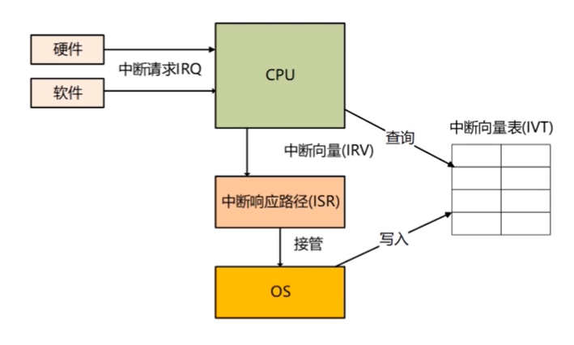
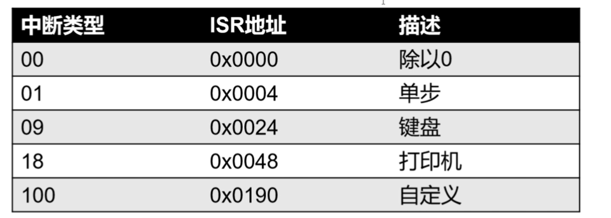
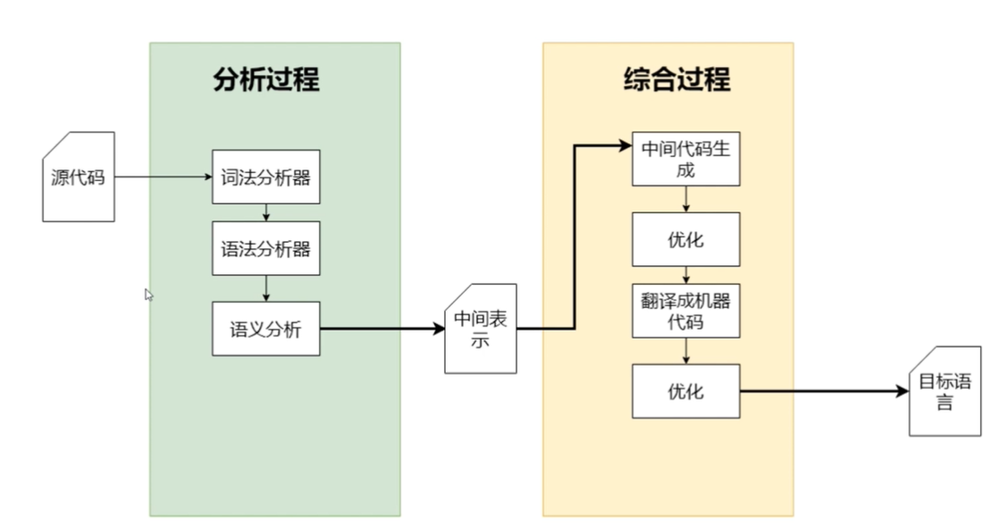

# 计算机基础


# 汇编入门

`CPU` 被时钟驱动，不断的读取 `PC` 指针指向的指令，增加 `PC` 指针从内存中读取指令并执行

不同的 `CPU` 架构使用不同的指令。目前使用最广泛的是 `RISC` —— 精简指令集


### 助记符

`opcode` 是 `6` 位数字，太过于抽象，不好记忆，通常采用助记符来记录他们


### 寻址模式

指令集的一部分，决定指令有几个操作符，地址如何计算


##### 寄存器寻址

操作符是寄存器，利用 `n` 位寻址 2<sup>n</sup> 个寄存器

`add $r10, $1, $r2`

`OP 目标寄存器 源寄存器1 源寄存器2 shamt funct`


##### 立即寻址

操作符中有值

`addi $r1, $zero, 10`

`OP 目标寄存器 源寄存器1 数字`

> 数字大小有限制


##### 偏移量寻址

根据基地址和偏移量寻址，最终地址实在基地址和偏移量上计算

`lw $r0, 8($sp)`

`op base寄存器 目标寄存器 偏移量`


##### `PC` 相对寻址

下一个 `PC` 指针的位置依赖当前位置到 `label` （当前代码和 `Label` 所在的代码行之差）

`beq $r3, $r1, LABEL`

`OP 比较目标1 比较目标2 相对差`


### 指令

##### 内存读写

`load/store`

- `load`
  - `lw`
  - `lb`
  - `lh` 

##### 数学寻址

- 立即寻址
  - `addi`
  - `subi`
  - `divi`
  - `multi`


### 浮点数

十进制里面的 `0.1` 代表 
$$
\frac{1}{10}
$$


二进制里面的 `0.1` 代表
$$
\frac{1}{2}
$$
单精度表示浮点数最后实际上是加法运算


双精度浮点数

`exponent fraction`

-1<sup>sign</sup> (1+b<sub>51</sub>b<sub>0</sub>) * 2 <sup>-1023</sup>


### 应用

求阶乘的递归函数

``` 
# if else
if (i == j){		bne $r3,$r4,ELSE
	f = i + j;		add $r5, r3, r4
} else {			j EXIT
	f = i - j;		ELSE:
}					sub $r5, r3, r4
					EXIT:
					
# for loop
sum = 0;
for (i = 0; i < 100; i++) {		
 	sum += i;
}

addi $s3, $zero, 0 		# 初始化 sum 变量
addi $s4, $zero, 0 		# i = 0
addi $s5, $zero, 100 	# 常数 100
LOOP:
beq $s4, $s5, EXIT
add $s3, $s4, $s3
addi $s4, $s4, 1
j LOOP
EXIT:

// 使用栈实现传参
fact(5)

addiu $s0, $0, 5		# 存入参数5到s0
sw $s0, $sp				# 将s0写入到sp
addi $sp, $sp, -4		# 栈指针指向下一个
jal FACT				# 跳转
```

> 标签翻译成距离该行的距离
>
> 函数体：LABEL；使用 `jal LABEL` 调用指令

压栈

`sp` 寄存器，随机初始值，将值填入当前位置，滑动指针 `-4 `

返回值

提前设置返回值为 `0`，待要返回结果时，使用偏移量重新定义返回值


### 中断

外界发生变化的时候，通过中断去通知 `CPU` 应该去注意某个信号（事件）


中断好处

- 提高工作效率 （思考 `polling`）
- 故障恢复 （异常处理）
- 简化编程模型 （`try/catch`）


`CPU` 当前的状态会压栈

 

- `OS` 加载时写入中断向量表
- 发生中断请求，发送给 `CPU`
- 查询中断向量表确定中断向量
-  根据中断向量确定中断程序
- `OS` 接管中断

> `OS` ： 操作系统
>
> 中断向量：终端类型到中断程序之间的映射


##### 中断类型

- 硬件设备发给主板（打印机、键盘、鼠标等）
- 硬件中断：CPU异常（除以0），时钟信号等
- 软件中断：发出（异常、切换到内核态等）


##### 中断向量表

将中断类型和中断响应程序对应关系，每一行叫做一个中断向量




# 编译原理

一门研究翻译的科学，将一种机器语言翻译成为另一种

> 让计算机理解更高级的语言并执行
>
> 翻译只能作用在形式语言上


### 编译器和解释器

编译器将源程序编译称为目标程序

解释器同时接收源程序和输入，执行并返回输出


##### 混合编译器

源程序通过第一次编译生成中间代码，中间代码第二次编译和输入一起输入到虚拟机中

> 中间代码更容易被翻译成为目标程序，优化空间更大，中间语言的存在更利于编译器的实现
>
> 虚拟机处理更加复杂的执行环境（跨平台）


##### 即时编译器

一种高效率的执行方式，中间代码不直接执行，而是被编译成机器码再执行

例如： `Java` 中一个类型的字节码第一次被执行时被编译成为机器码，第二次执行的时候不需要再编译


##### 交叉编译

在一个平台编译产生多个平台的可执行代码


##### 优劣

解释执行有性能问题，但是也异常的灵活；支持 `eval` 函数，意味着程序可以动态修改

直接交叉编译存在跨平台的问题；一次编译很多包也会产生分发问题

虚拟化技术提供了更好的体验，却没有提供更好的性能（`JIT` 解决该问题）


##### 编译流程

关注度分离

- 词法分析
  - 根据语句生成语法表
- 语法分析
  - 将语法表建立成为一棵语法树
- 语义分析
  - 对抽象语法树进行语义检查
- 翻译成机器码

> 编译器处理的两大过程：
>
> 分析——对源程序进行分析形成中间表示
>
> 综合——根据中间表示生成目标语言，提供运行环境


##### 运行时环境

编译器将代码编译成机器码，按照操作系统编译成一个应用，运行成为操作系统的一个进程

编译器将代码翻译成为中间代码（字节码，三地址代码等），在操作系统中启动一个虚拟容器（进程）来执行他们

`JIT` 编译一般执行中间代码，一边编译


##### 编译器分层设计

常见的软件架构



> 难点：
>
> 关注度分离，每一层是否都有意义
>
> 每一层是否有优质的算法数据结构、架构技巧去解决大量共性的问题


### 词法分析

将字符流转成符号流，词法分析的过程类似我们中学语文学习的词性标注，每一个符号是一个元组，应该至少包含一个字符串和词性描述

词法分析器的结果是一个个符号， `Token`，也叫词法单元