# 计算机组成原理

### 冯诺依曼结构

两个重要的设计思想

- 存储器（不是开关连线）
- 二进制

计算机的五部分

- 运算器 (`CA`)
- 控制器 (`CC`)
- 存储器 (`M`)
- 输入设备 (`I`)
- 输出设备 (`O`)

**数据和程序** 均以 **二进制代码** 形式不加区别的存放在存储器中，存放位置由存储器指定

##### 核心

运算器，控制器和存储器是冯诺依曼结构的核心

##### 主存

- 地址
  - 每个存储单元对应的编号
- 内容
  - 存储单元存放的信息

> **主存** 货架存放物品，**CPU** 厨师 **运算器** 厨房

##### 模型机的构建

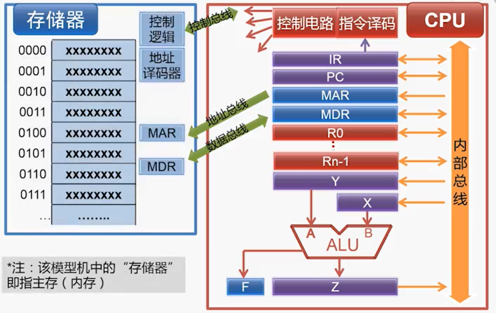

> 存储单元的地址是唯一的，存储单元的位宽由设计计算机时的编址方式决定。如果按字节编址，每个存储单元存放 `8` 位二进制数

##### `MAR`

`Memory Address Register` 存放 `CPU` 正在读或写的存储单元地址

##### `MDR`

`Memory Data Register` 存放 `CPU` 正在读出或即将写入存储单元的数据

- `IR`
  - 指令寄存器，存放正在执行或即将执行的指令
- `PC`
  - 程序计数器，存放下一条指令的存储单元地址，具有自动增长计数
- 指令译码
  - 对 `IR` 中的指令进行译码
- 控制电路
  - 根据指令译码的结果，控制电路产生控制信号，控制组件动作

### 计算机执行指令主要步骤

- 取址
- 译码
- 执行
- 回写

### 运算器

核心部件为 `ALU` 用于完成算数核心运算和逻辑运算

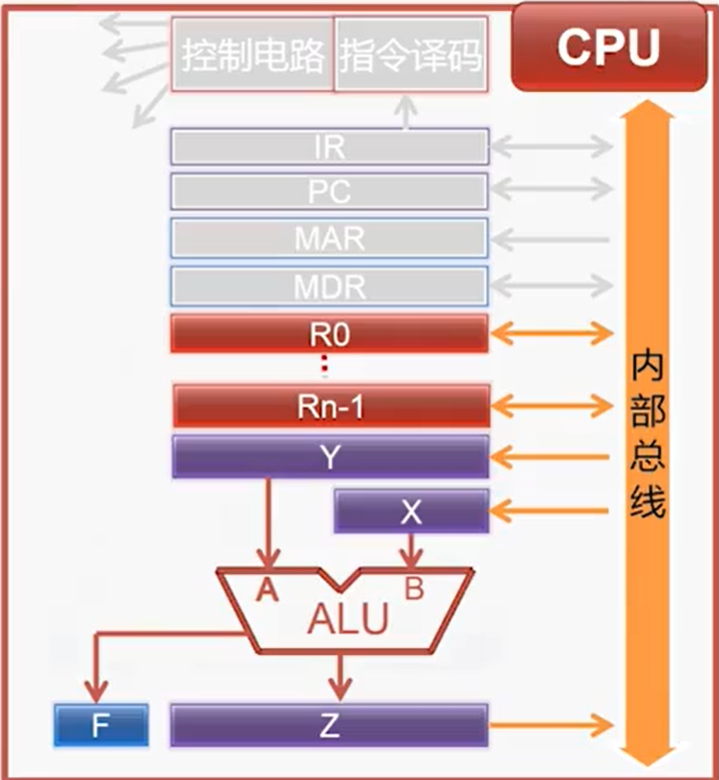

- `ALU` 将 `X` `Y` 中取到数经过运算存储到 `Z` 中
- `F` 用于存放运算结果的状态 (零/正负/溢出/进位/)
- 通用寄存器用来存放临时数据
  - 数据可以来自存储器或 `ALU` 的输出

##### 冯诺依曼结构原理和实现

- `CPU`
  - `CA`
  - `CC`
- 主存
  - `M`
- 北桥
- 南桥
  - `I/O`
  - 硬盘
    - `R`
  - `BIOS`
    - `R`

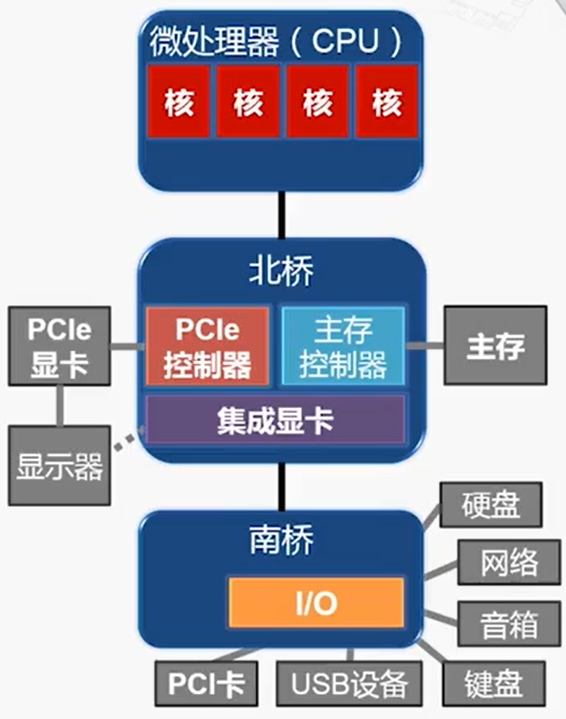

> 为了解决影响性能最大的问题 `CPU` 访问主存的通道，北桥中的主存控制器移到 `CPU` 中，之后便是显示部件
>
> 最终大部分的北桥中的原本功能移植到了 `CPU` 中，将南北桥的功能集成到了南桥芯片中

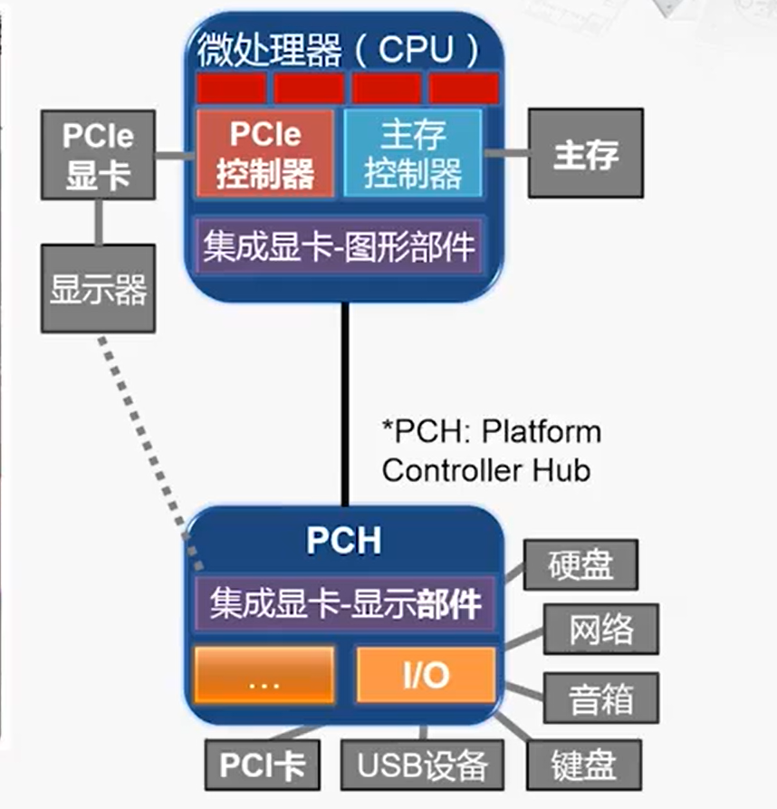

##### 系统芯片

将计算机或者其他电子系统集成为单一芯片的集成电路

### 指令系统

- 设计指令
  - 运算指令
    - `ADD R,M`
  - 传送类指令
    - `LOAD R,M`
  - 转移类指令
    - `JUMP L`
- 指令格式
  - 每条指令等长，均为 `2` 字节
  - 第一个字节的高 `4` 位为操作码
  - 第一个字节的低 `4` 位为寄存器号
  - 第二个字节为存储单元地址

### `X86` 体系架构

##### `8086`

- 内部通用寄存器为 `16` 位，能处理 `16` 和 `8` 位数据
- 对外有 `16` 根数据线和 `20` 根地址线，可寻址 `1MByte` `(2^20)`
- 物理地址使用 “段 + 偏移”

##### 实模式

实地址模式，为了兼容 `8086` ，所有的 `x86` 处理器加电或复位后首先进入实模式

系统初始化程序在实模式下运行，为进入保护模式准备

##### `80386`

第一款 `32` 位微处理器

改进保护模式，增加虚拟 `8086` 模式，可以同时模拟多个 `8086`

##### 保护模式

之后的微处理器的主要工作模式

- 支持多任务
- 支持设置特权级别
- 支持访问权限检查
- 可以访问 `4GB` 物理存储空间
- 引入虚拟存储器

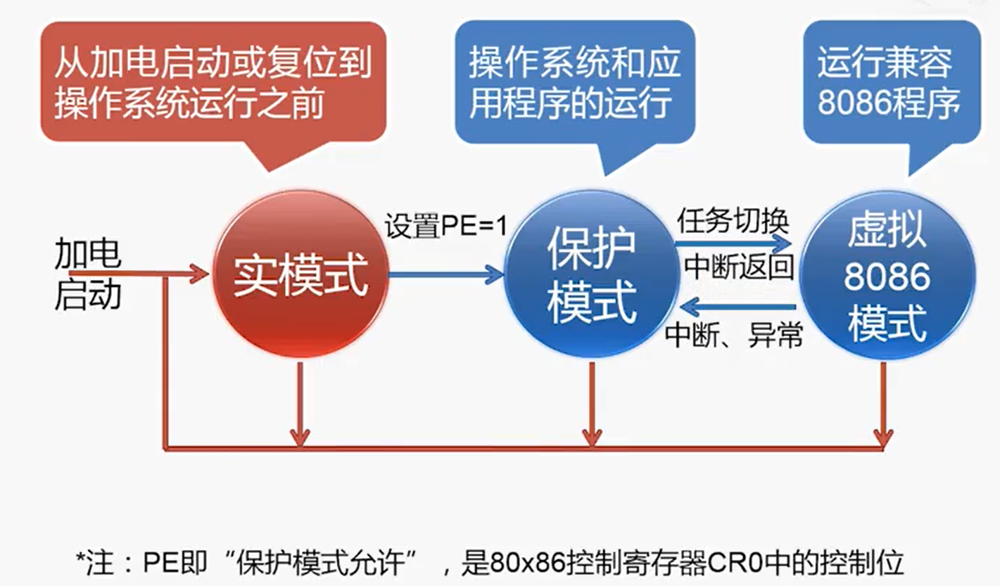

> 无论是什么模式，在复位之后都会从 **实模式** 重新开始运行

##### `x86-64`

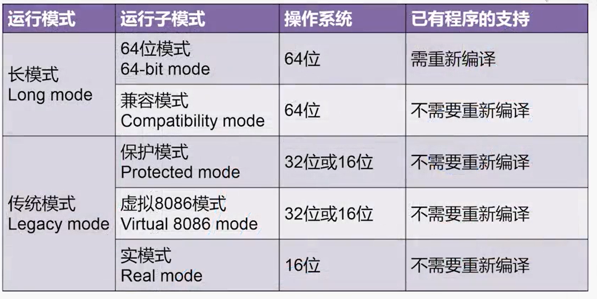

寄存器模型

- `x86`
  - 通用寄存器，指令寄存器，标志寄存器扩展到 `32` 位
  - 段寄存器扩展 `2` 个
- `x86-64`
  - 通用寄存器，指令寄存器，标志寄存器扩展到 `32` 位
  - 增加 `8` 个通用寄存器

寻址

- `x86`

  - 指令靠指针寄存器 `IP`
    - 保存一个内存的地址，指向需要的指令
    - 取出一条指令之后，`IP` 自动增长
    - 无法直接操作 `IP`

  

地址计算

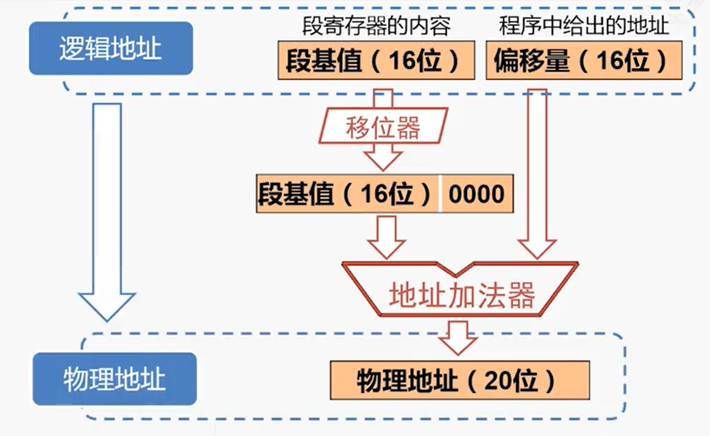

> 物理地址 = 段地址 * 16 + 偏移量

### `MIPS` 体系

流水线不互锁的微处理器，通过减少指令和减低指令的复杂度来支持 `CPU`

- 固定指令长度
  - 简化从存储器取指令
- 简化寻址模式
  - 简化取出操作
- 指令数量少，指令功能简单
  - 简化执行过程
- 简化指令导致需要更加强大的编译器的支持

### 门电路

##### 晶体管

`MOS` 晶体管（金属氧化物半导体）

- `N-MOS`

  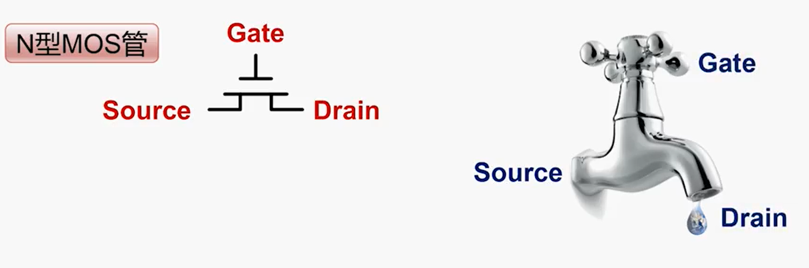 

> `N-MOS` 和 `P-MOS` 区别在于在高电平时是否导通

### 寄存器

##### `D`触发器

 具有存储信息能力的基本单元

- 照相机 + 显示器 --> `D` 触发器
- 每隔十秒按下快门（时钟的频率`0.1hz`）
- 按下快门之后，显示器上显示（CLK-to-Q 时间）
- 按下快门前后，显示器上的图像不发生变化（`Setup/hold` 时间）

> 在时钟 `clock` 沿（0 --> 1），采样输出 `D` 的值，传送到Q，其余时间输出 `Q` 的值不变
>
> 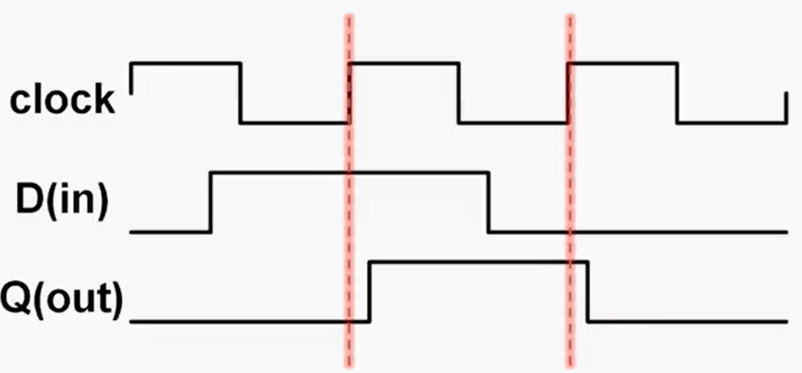

## `ALU` 逻辑运算的实现

与或运算，将 `32` 位的寄存器通过门并排相连

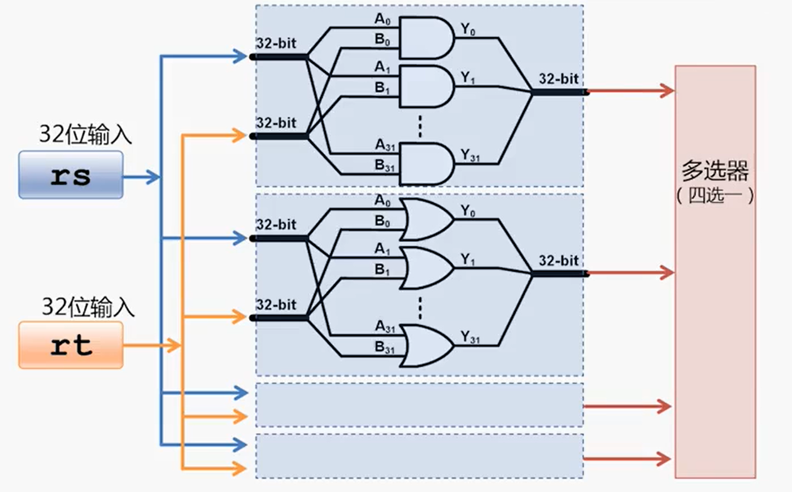

> 多选器通过选择信号选择运算类型

##### 加减法实现

半加器

将两个一位二进制数相加

- `A B` 为输入端口
- 输出 `S` 和 `C` 进位

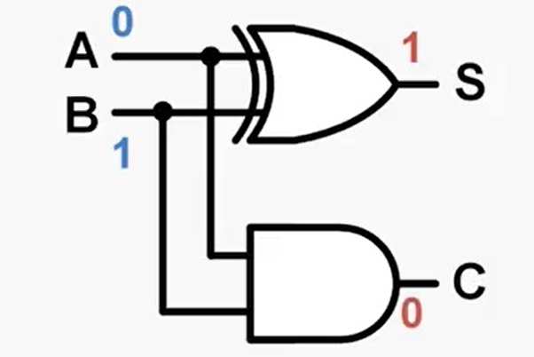

全加器

两个半加器组合

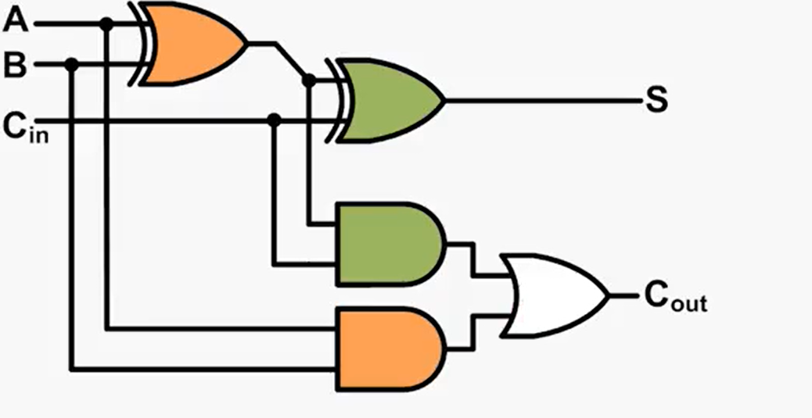

> 加法器串联即可以运算多位加法运算
>
> 溢出：
>
> 仅对有符号数，两个正数相加，结果为负
>
> 进位和溢出不相等
>
> 溢出的检查：最高位的进位输入不等于最高位的进位输出

减法运算

将被减数取补码

> 补码标识二进制数的相反数
>
> 按位取反，末位加一

##### 行波进位加法器

低位的全加器 Cout 连接到高位的 Cin 

- 电路布局简单，设计方便
- 高位运算必须等待低位运算完成，延迟时间长

##### 超前进位加法器

每一个定位仅需要三级门延迟就能计算，但是位数越多电路越复杂

> 一般是实现的方法：
>
> 先构成较小的超前进位加法器，再用超前加法进位器构成行波加法进位器

##### 乘法的实现

使用二进制数运算，被乘数根据运算依次左移，将结构与之前的结果依次相加

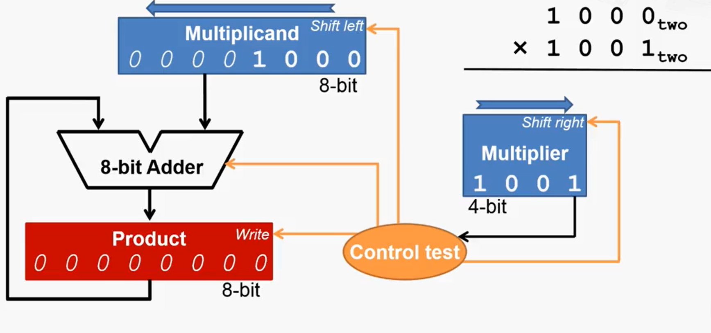

1. 检查存数寄存器的最低位
   1. 结果为 `1` ，将存数寄存器和被存数寄存器相加，结果放入存数寄存器
2. 被存数寄存器左移一位
3. 乘数寄存器右移一位
4. 判断循环是否结束

> 优化：
>
> 将 `1.1` `2` `3` 在一个时钟周期内完成

优化乘法寄存器

- 被乘数寄存器缩减为 `4` 位，取消左移功能
- 取消乘数寄存器，乘数存放在乘积寄存器的低四位
- 乘积寄存器增加右移功能，初始值位于高四位
- 加法器变为 `4` 位，只有高四位参与运算

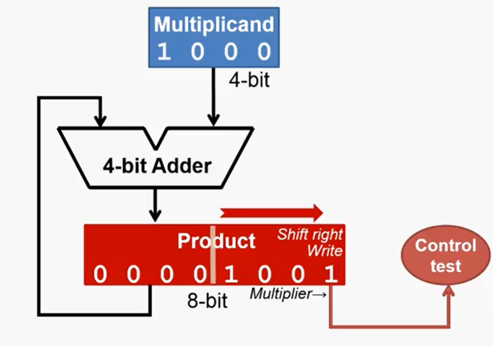

##### 除法运算

> 在除法器中需要加法器（回退）和减法
>
> 余数寄存器，除数寄存器（带右移功能），商寄存器（带左移功能）

# 处理器

### 步骤

- 分析指令系统，得出对数据通路的要求
- 选择合适的组件
- 建立合适的数据通路
- 分析每一条指令的实现，确保控制信号
- 形成完整的控制逻辑

### 需求

- 算数逻辑单元
  - 操作数，两个 `32` 位的数，来自寄存器或者扩展后的立即数
- 立即数扩展部件
  - 将一个 `16` 位的数扩展为 `32` 位
  - 扩展方式 
    - 零扩展
    - 符号扩展
- 程序计数器
  - 一个 `32` 位的寄存器
  - 至此两种加法 
    - 加 `4`
    - 加一个立即数
- 寄存器堆
  - `32` 个 `32` 位寄存器
  - 两读一写
- 存储器
  - 一个只读存储器，地址和数据为 `32` 位
  - 一个可读写的数据存储器，地址和数据 `32` 位

### 建立数据通路的方法

根据指令需求，连接组件，建立数据通路

##### 共同需求

取指令

程序计数器的内容是指令的地址；访问其内容作为地址，获取指令编码

更新程序计数器
