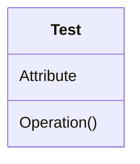
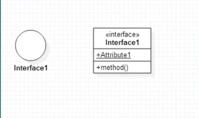
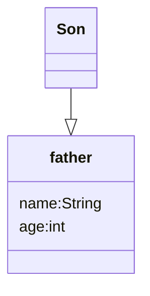
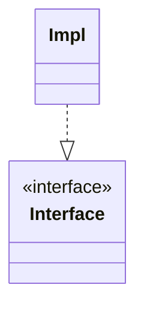
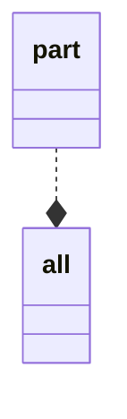
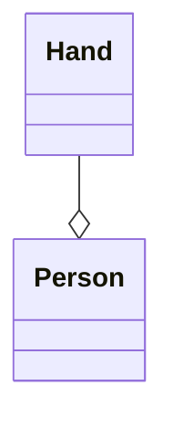

[返回](../DesignPattern.md)

# `UML`

`Unified Modeling Language` 统一建模语言或标准建模语言

- 统一标准
- 面向对象
- 可视化，表现力强
- 独立于过程，不依赖特定的软件开发过程
- 概念明确

##### 分类

###### 结构图

- 类图
- 对象图
- 构件图
- 部署图
- 包图

###### 行为图

- 活动图
- 状态机图
- 顺序图
- 通信图
- 用例图
- 时序图

###### 使用频率

- 必用
  - 类图
  - 活动图
  - 顺序图
  - 用例图
- 常用
  - 包图
  - 状态机图
- 服务器开发
  - 构件图
  - 部署图

# 类图

### 类

- 修饰属性和方法

- 访问权限
  - | `+`  | `public`    |
    | ---- | ----------- |
    | `-`  | `private`   |
    | `#`  | `protected` |
    | `~`  | `package`   |
  
- 其他关键字

  - 下划线 	
    - `Static`
  - 斜体
    -  `abstract`
  - 冒号
    - 表示成员类型
    - 方法的返回值
  - 等号
    - 默认值
  - 方法参数和类成员变量相同

### 接口

##### 表现形式

- 圆圈
- 名字上带有 `<<interface>>`

### 类与继承泛化

##### 泛化关系

由一般到特殊的继承关系，子类特化父类的所有的特征和行为

##### 箭头

带三角的箭头，箭头指向父类

##### 代码表现

`extends`

### 接口与实现

##### 实现

表示类的所有特性和行为实现

##### 箭头指向

带三角箭头的虚线，箭头指向接口或者是直线连接圆圈

##### 代码实现

`implements`

### 依赖

##### 依赖

一种使用关系，一个类的实现需要另一个类的协助（尽量不适用双向的互相依赖）

##### 代码实现

`import`

### 关联

##### 关联

一种拥有关系，一个类知道另一类的属性和方法

##### 代码实现

成员变量

##### 箭头

带普通箭头的实心线，指向被拥有者

> 双向关联可以有两个箭头或者没有箭头

### 聚合关系

##### 聚合

整体户部分的关系，部分可以离开整体而单独存在

##### 代码实现

成员变量

##### 箭头及指向

带空心菱形的实心线，菱形指向整体

### 组合关系

##### 组合

整体和部分的关系，部分不能离开整体而单独存在

##### 代码实现

成员变量

##### 箭头及指向

带实心菱形的实线，菱形指向整体

### 类的关系强弱对比

泛化 = 实现 > 组合 > 聚合 > 关联 > 依赖

##### 生命周期

###### 组合

整体对象负责代表部分对象的生命周期

###### 聚合

部分和整体的生命周期不一定相同

###### 关联

两个类之间有交互

###### 依赖

完全无关