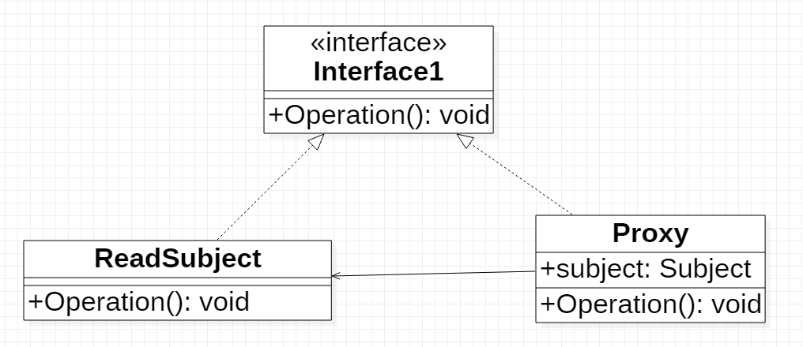
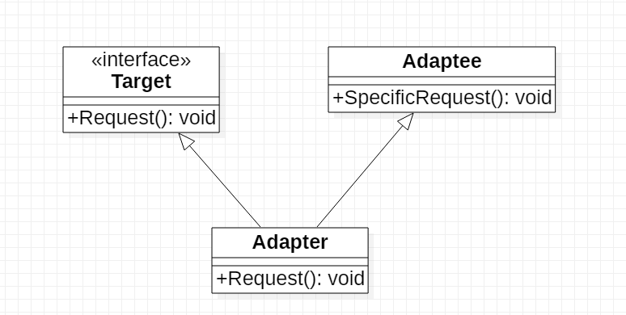
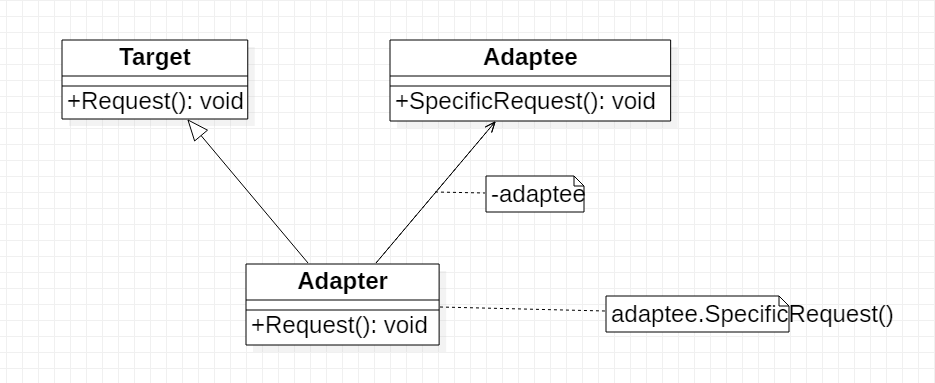

[返回](../DesignPattern.md)

# 结构型模式


### 代理模式

为其他对象提供一种代理以控制对这个对象的访问

一些情况下，一个对象不适合或者不能直接引用另一个对象，代理对象在代理对象和客户端中起中介作用



##### 抽象主题角色（`Subject`）

可以是抽象类也可以是接口


##### 具体主题角色（`RealSubject`）

委托角色，被代理角色，业务逻辑的具体执行者


##### 代理主题角色（`Proxy`）

委托类，代理类

把所有抽象主题类定义的方法给具体主题角色实现，并在具体主题角色处理完毕前后预处理和善后工作——比如：打印日志


##### `Java` 的动态代理

###### 静态代理

自己手写的代理类（程序运行之前存在的代理类）

###### 动态代理

根据反射机制自动生成


###### `Proxy`

```java
Object Proxy.newProxyInstance(Class loader, Class<?>[] interfaces, InvocationHandler handler, InvocationHandler handler) throws IllegalArgumentException
    
# loader, 类加载器（不同的类需要不同的类加载器）
# interface，被代理对象共有的接口
# handler，调用处理器，必须实现 InvocationHandler 接口的对象
```


###### `InvocationHandler`

> `InvocationHandler` 对于 `Proxy`，例如 `Runnable` 对于 `Thread`

```
object invoke(Object proxy, Method method, Object[] args) throws Throwable

# proxy，该方法代理的对象
# method，真实对象需要实际需要执行的方法
# args，真实对象执行时需要的参数
```


### 适配器模式

将一个类的接口转换为另一个类的接口，解决接口不兼容的问题


##### 类的适配器模式



- `Target`
  - 目标角色：期待得到的接口
- `Adapee`
  - 源：需要的适配器接口
- `Adapter`
  - 适配器


##### 对象的适配器模式



和类适配不一样的是，对象适配器不适用继承而是使用委派的关系


##### 对比

类适配器使用对象继承的方式，是静态的定义方法

对象适配器使用的是对象组合的方法，动态的组合


类适配器无法使用目标类的子类


类适配器可以通过子类覆盖父类的方法重新定义部分行为


##### 建议

建议使用对象适配器，多用聚合、合成，少用继承