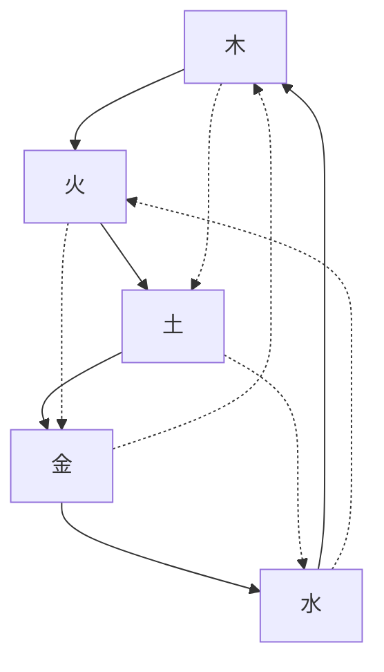

# 八字基础

### 阴阳五行

##### 五行

- 木
  - 曲直；生长；修长；仁慈
- 火
  - 炎上；热情；礼貌
- 土
  - 载物；内向；固执
- 金
  - 从革；顺从；变革
- 水
  - 润下；智慧

##### 相生相克

> 南方水，北方火，东方木，西方金，中央土

分同性和异性，同性的力量比较大

###### 反克

两种悬殊太大，无法相生

###### 相克

制约

### 天干

甲乙丙丁戊己壬癸

##### 四时

- 春
  - 123
- 夏
  - 
- 秋
- 冬
- 季末
  - 369
  - 属土

##### 方位

- 东南西北
- 中

##### 人体

阳天干

- 腑

阴天干

- 脏

##### 五合

- 甲己中正之合
  - 土
- 乙庚仁义之合
  - 金
- 丙辛威正之合
  - 水
- 丁壬淫昵之合
  - 木
- 戊癸无情之合
  - 火

##### 冲

- 四组相冲

- 阳冲阳，阴冲阴

- 合与化

  - 合而不化
  - 合化

  > 两者力量全部减小

### 地支

子丑寅卯辰巳午未申酉戌亥

- 奇数为阳，偶数为阴
- 地址对应十二个月，月也叫月建
- 立春为节，雨水为气
  - 立春算是一年的开始
- 子时
  - 0-1 早子时
  - 23-24 晚子时
- 气

|      | 子   | 丑   | 寅   | 卯   | 辰   | 巳   | 午   | 未   | 申   | 酉   | 戌   |亥|
| ---- | ---- | ---- | ---- | ---- | ---- | ---- | ---- | ---- | ---- | ---- | ---- | ---- |
| 本气 | **癸** | 己 | 甲 | 乙 | 戊 | **丙** | **丁** | 己 | 庚 | 辛 | 戊 |**壬**|
| 中气 | X | 辛 | 丙 | X | 癸 | 戊 | 己 | 乙 | 壬 | X | 丁 |甲|
| 余气 | X | 癸 | 戊 | X | 乙 | 戊 | X | 丙 | 戊 | X | 辛 |X|

##### 合

- 三合

  - 申子辰三合水局
  - 寅午戌三合火局
  - 亥卯未三合木局
  - 巳酉丑三合金局

  > 带中间的两个叫做半合；两边的叫做拱局

- 六合

  - 生合
  - 克合 

  > 化由下往上：土木火金水火

合如果成功会化出新元素，其他元素力量减小

##### 会

- 四季

> 三会 > 三合 > 六合

##### 相冲

- 冲中有克
  - 除辰戌，丑未
- 同性相冲
- 对角相冲

> 时间短力量大
>
> 冲的力量比克的力量大，时间短，被冲的一方影响大

##### 相害

- 横折

##### 相刑

地支之间力量差距比较大（假生）

- 子卯
- 寅巳申
- 丑戌未
- 辰午酉亥
  - 自刑

> 三合三会依次排相应的相刑

### 旺衰

