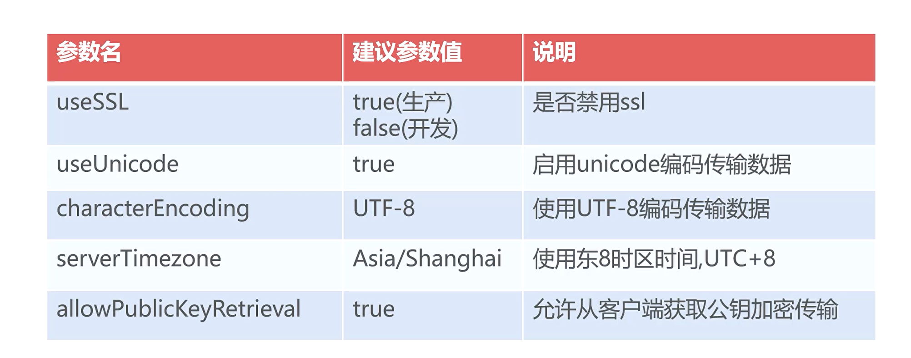
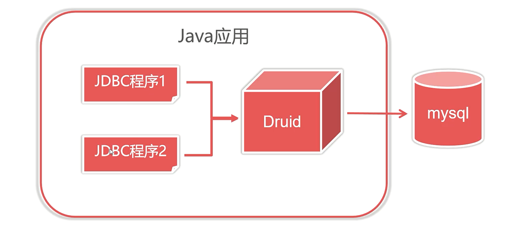

# `JDBC`

`JDBC` 是一个标准，平台提供标准，厂商提供实现 


- 加载并注册 `JDBC` 驱动
- 创建数据库连接
- 创建 `statement` 对象
- 遍历查询结果
- 关闭连接，释放资源


##### `Mysql` 连接字符串

```
jdbc:mysql://[主机ip][:端口]/数据库名?参数列表
# 主机IP默认为：127.0.0.1
# 端口默认为：3306
```


##### `Mysql` 连接时常用的参数




### 事务的实现

事务依赖数据库的实现，`Mysql` 通过事务区作为缓冲地带

- 自动提交事务模式
  - 默认模式，每次执行写操作的 `SQL` 时，自动执行提交
- 手动提交事务模式

```mysql
conn.setAutoCommit(false);
```


### 基于实体类实现分页数据封装

```mysql
select * from table limit ?,10;
```

> 注：`limit` 是 `mysql` 中特有的关键字


### 日期类型是处理方案

```java
Date date = rs.getDate();

# String 转换为 java.util.Date
SimpleDateFormat sdf = new SimpleDateFormat("yyyy-MM-dd");
java.util.Date date = sdf.parse(str);

# 将 java.util.Date转换为 java.sql.Date
long time =  date.getTime();// 获取自 1970 年以来的毫秒数
java.util.Date sdate = new java.sql.Date(time);
```

> 在 `JDBC` 实现中 `Date` 和 `Datetime` 对象转换都为 `java.sql.Date` 其继承自 `java.util.Date`


### 数据的批处理

批量的情况下，仅仅插入的数据不同但是 `JDBC` 对同意语句进行多次解析

```java
# 区别
pstmt.addBatch(); // 替代 pstmt.executeUpdate()
```


### 连接池

##### `Druid`

`Druid` 阿里巴巴的开源连接池组件，对数据库进行有效的管理和重用，最大化程序的执行效率



- 加载属性文件
- 获取 `DataSource` 数据源对象
- 创建数据连接


> 使用连接池和不使用连接池的区别：
>
> 不使用连接池：`conn.close()` 关闭连接
>
> 使用连接池：将连接回收到连接池


##### `C3P0` 连接池

- `c3p0-*.jar `
- `mchange-commons-java-*.jar`

`C3P0` 不使用属性文件而是使用 `c3p0-config. xml` 文件来保存配置信息

> 书写 `xml` 文件时候需要注意转义字符


### 数据库工具组件

`Apache Commons DBUtils`

```java
# 查询
QueryRunner qr = new QueryRunner(dataSource);
List<E> list = qr.query("select * from table limit ?,10",
	new BeanListHandler<>(E.class),
	new Object[]{10});
# 更新
String sql = "";
QueryRunner qr = new QueryRunner();
qr.update(conn,sql,new Object[]{})
```

