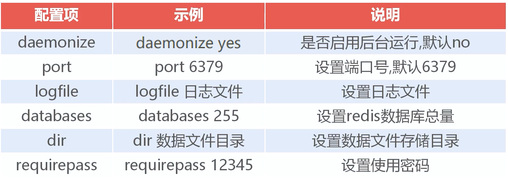
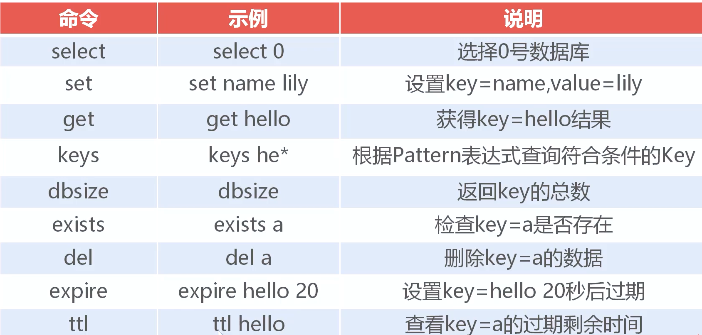
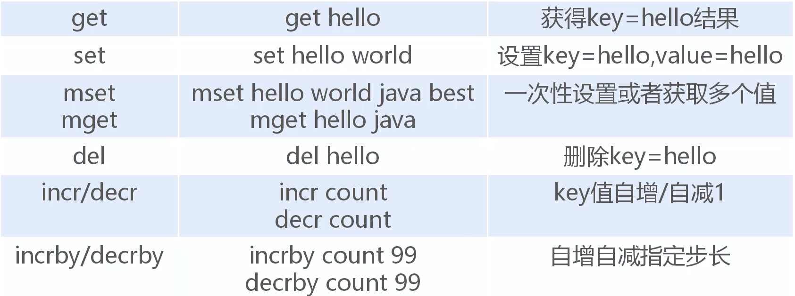
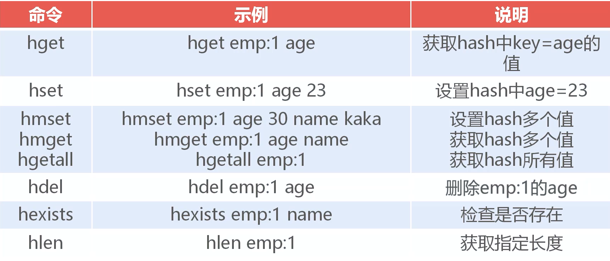

# `Redis`

基于键值对类型的 `NOSQL` 数据库，将数据存储到内存中，同时可以持久化到磁盘

常用于缓存数据，利用内存的高效率提高程序的运行速度


### 特点

- 速度快
- 广泛的语言支持
- 持久化方案
- 多重数据结构
- 主从复制
- 分布式高可用


### 常用的配置




### 常用命令



> 一般不使用 `keys *` 可能会全表扫描


### 常用数据类型

- `String`
- `Hash`
- `List`
- `Set`
- `ZSet`


##### `String`

`String` 最大不能超过 `512mb` ，一般单个 `kv` 不超过 `100kb`


常见字符串操作命令




##### `Hash` 

用来存储结构化数据




##### `List`

字符串数组，按顺序排序

- `rpush listkey c b a`
  - 右侧插入 `(c b a)`
- `lpush listkey c b a`
  - 左侧插入 `(a b c)`
- `rpop listkey`
  - 右侧弹出
- `lpop listkey`
  - 左侧弹出
- `lrang list 0 -1`
  - 查看元素


##### `Set` 和 `ZSet`

`Set` 字符串无序集合，集合成员唯一

`ZSet` 字符串有序集合，集合元素唯一


- `sadd set a`
  - 创建集合
- `smember set`
  - 查看元素
- `sinter set1 set2`
  - 查看两个 `set` 的交集
- `sunion set1 set2`
  - 查看并集
- `sdiff set1 set2`
  - 差集
- `zset zset1 0 -1 withscores`
  - 查看 `zset` 及分数
- `zrangbyscore zset1 100 103`
  - 排序


### `Jedis`

`java` 语言开发 `Redis` 客户端的工具包


##### 配置

- 关闭保护模式，允许远程连接

  - ```
    protected-mode no
    bind 0.0.0.0 # 测试环境使用
    ```

- 防火墙放行端口


##### 应用

缓存数据

- 创建 `Jedis` 核心对象

- `Json` 序列化数据
- 将数据保存到 `String` 类型的数据库

提取数据

- 判断键是否存在
- 取出该键对应的值
- 使用 `Json.parseObject()` 转换到目标类


> 缓存数据要求：
>
> 数据量不能太大
>
> 数据更新频率较低