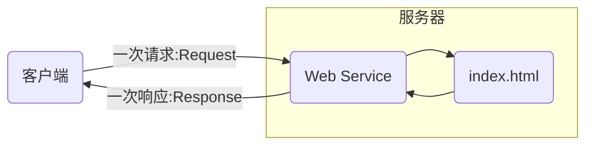
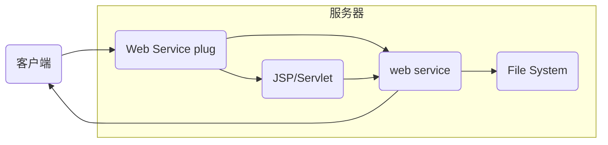

[返回](../JavaWeb.md)

# 介绍

###  `web` 开发

静态 `web`

> 无法动态更新

动态网站 `web`

> 如果动态 `web` 资源出现错误，需要停机维护

### `web` 应用程序

可以提供浏览器访问的程序

### `Web` 服务器

- `ASP`
  - 在 `HTML` 脚本中嵌套 `VB` 脚本
  - 维护成本较高
- `JSP`
  - 可以承载三高问题
  - `ASP` 加强版
- `php`
  - 速度快，代码简单
  - 无法承受大量访问

##### `Web` 服务器

服务器一种被动的操作，处理用户请求和给用户一些响应信息

- `IIS`
  - 微软的服务器；主要用来 `ASP`, `Windows`自带
- `tomcat`

### 静态 `Web`

后缀名为 `.html`  的文件，我们可以通过服务器直接读取

> 缺点： `Web` 页面无法更新，所有用户用的是一样的；无法和数据库交互
>
> 实现伪动态：
>
> 轮播图；`JavaScript`; `VBScript`

### 动态 `Web`

> 缺点：一旦动态资源出现问题，需要宕机
>
> 