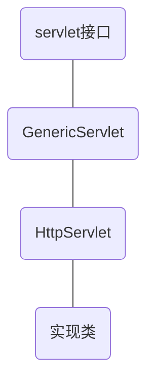
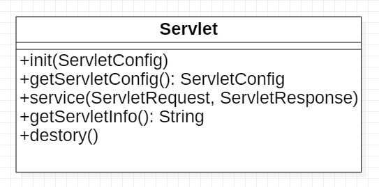
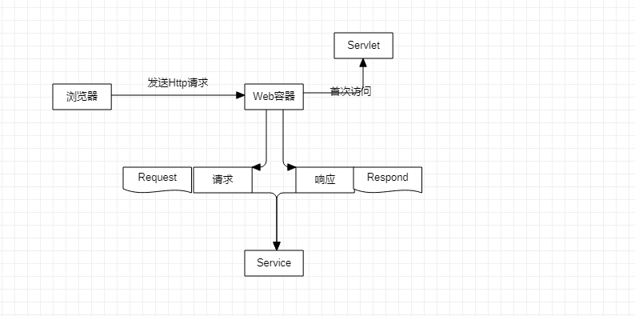

# servlet


### 简介

- 一门开发动态 `web`  的技术
- 这些 `API` 中提供一个接口 `Servlet`，
  - 实现接口
  - 开发好的 `java` 类部署到 `web` 服务器中


### 编写一个 `Servlet` 程序

1. 构建一个 `Maven` 项目，删除里面的 `src` 目录（这个空的工程为 `Maven` 的主工程）

2. `Maven` 父子工程

   父项目中

   ```xml
   <modules>
   	<module>servlet-01</module>
   </modules>
   ```

   子项目

   ```xml
   <parent>
       <artifactId></artifactId>
       <groupId></groupId>
       <version></version>
   </parent>
   ```

   > 父项目中的 `java` 子项目可以直接使用


### `Maven` 环境优化

1. 修改 `web.xml` 为最新
2. 将 `maven` 的结构搭建完整


### 编写一个 `Servlet` 程序 

1. 编写一个普通的类

2. 实现 `Servlet`  接口

   > `Servlet` 有两个默认的实现类: `HttpServlet` 和 `GenericServlet`

3. 重写 `doGet` 和 `doPost` 方法

   > 由于 `get` 和 `post` 只是实现请求的不同方式，可以相互调用，业务逻辑都是相同的
   
   ```java
   public class HelloServlet extends HttpServlet {
     @Override
     protected void doGet(HttpServletRequest req, HttpServletResponse resp) throws ServletException, IOException {
         // 响应流
         PrintWriter writer = resp.getWriter();
         writer.println("Hello servlet!");
     }
   
     @Override
     protected void doPost(HttpServletRequest req, HttpServletResponse resp) throws ServletException, IOException {
         super.doPost(req, resp);
     }
   }
   ```







5. 编写 `Servlet` 的映射

   通过浏览器访问 `Java` 程序，需要在 `Web` 中注册 `Servlet` 程序，给他一个浏览器能够访问的路径

   ```xml
   	<!-- 注册Servlet -->
       <servlet>
           <servlet-name>Hello</servlet-name>
           <servlet-class>com.company.servlet.HelloServlet</servlet-class>
       </servlet>
       <!-- Servlet请求路径-->
       <servlet-mapping>
           <servlet-name>Hello</servlet-name>
           <url-pattern>/hello</url-pattern>
       </servlet-mapping>
   ```

6. 配置 `Tomcat`

    

### `Servlet` 原理

`Servlet` 是由 `Web` 服务器调用，`Web` 服务器在收到请求之后

