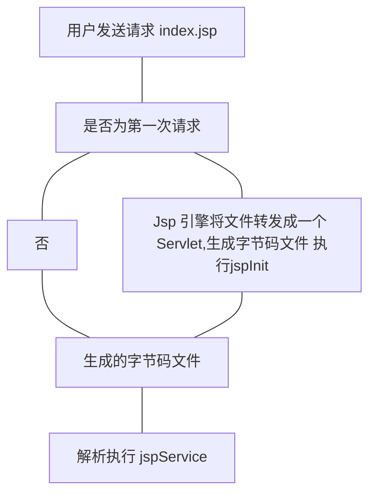

# Jsp 的基础语法


### 三种指令

`page 指令` 通常位于 `jsp` 页面的顶端，同一个页面可以有多个 `page` 指令

`include 指令` 将一个外部文件嵌入到当前的 `jsp` 页面中，同时解析这个页面的 `jsp` 语句

`taglib 指令` 使用标签库定义新的自定义标签，在 `jsp` 中启用定制行为


##### `page 指令`

```jsp
<%@ page"属性=属性值"
%>

# 常用的属性
language 指定使用的脚本语言(java)
import 引用脚本语言中使用的类文件
contextType 指定jsp页面采用的编码 (text/html ISO-8859-1)
```


##### 注释：

- `html` 注释

  客户端可见

  ```html
  <!--html-->
  ```

- `jsp` 注释

  客户端不可见

  ```jsp
  <%--html--%>
  ```

- `jsp` 脚本注释


### `jsp` 声明

在 `jsp` 页面定义变量或方法

```jsp
<%! java code%>
```


### `jsp` 表达式

```
<% =表达式 %>
# 表达式不以分号结束
```


### `jsp` 的生命周期



###  `jsp` 内置对象

`jsp` 内置对象是 `web` 容器创建的一组对象，可以直接使用 

##### 常用的对象

`out` `request` `response` `session` `application`

`page pageContext config exception`


##### `out` 对象

向客户端输出内容的常用对象

常用的方法

```
println()	打印字符串
clear()		清除缓冲区，如果在 flush 之后调用会抛出异常
clearBuffer()	清除缓冲区，flush 之后不会抛出异常
flush()		将缓冲区的内容输出到客户端
getBufferSize():int 	返回缓冲区，如果不设缓冲区则返回 0
getRemaining():int		返回缓冲区还剩余多少可用的资源
isAutoFlush():boolean	缓冲区已满时是否自动清空或抛出异常
```


##### `get` 和 `post`

`get` 一般以明文的方式通过 `URL` 提交数据，数据在 `URL` 中可以直接看到。提交的数据最多不超过 `2kb` 安全性较低但是效率比 `post` 方式高。适合提交数据量不大，安全性不高 

> 搜索，查询等功能


##### `post`

将用户提交的信息封装到 `HTML` `HEADER` 内。适合提交数据量大，安全性高的用户信息。

> 注册，上传等功能


##### `request`

客户端的一次请求，具有请求域（完成请求之前一直有效）

```jsp
getParameter(String):String			返回值
getParameterValues(String):String[]	返回包含参数 name 的所有值的数组
setAttribute(String,Object)			存储此请求中的属性
getAttribute(String):Object			返回指定属性的属性值
getContentType():String				得到请求体的 MIME 类型
getProtocol():String				返回请求用的协议类型及版本号
getServerName():String				返回请求接受请求的服务器主机名
getServerPort():int					返回服务器接收请求时返回的端口号
getCharacterEncoding():String		返回编码
setContentEncoding()				设置请求的字符编码
getContentLength():int				返回请求长度(字节)
getRemoteAddr():String				返回客户端IP
getRealPath():String				返回虚拟路径的真实路径
getContextPath():String				返回上下文路径(虚拟路径)
```

```
<%
	request.setCharacterEncoding=UTF-8
%>
# 可以解决中文乱码问题，但是无法解决URL传递出现的乱码
可以在配置文件 server.xml 中添加 URLEncoding="utf8"
```


##### `response` 对象

包含客户端请求的相关信息，但是实际上很少使用。具有页面作用域（只能对这次访问有效）

```
getCharacterEncoding():String		返回响应使用的编码
setContentType(String)				设置响应的 MIME 类型
getWriter():PrintWriter				返回一个输出流对象(和内置的 out 对象有区别，PrintWriter优先)
sendRedirect(String)				重新定向客户端请求
```


##### 请求转发和重定向

重定向时：客户端行为，`response.sendRedirect()`，本质上来讲是两次请求，前一次请求的地址对象不会保存，地址栏 `URL` 发生变化

请求转发：服务器行为，`request.getRequestDispatcher().forward(req,resp)` 本质上是一次请求，转发后对象会保存，`URL` 不变


##### `session`

客户端和服务器的一次会话

`web` 中指的是用户在浏览某网站，从进入网站到浏览器关闭经过的时间

> 保存在服务器的内存当中，不同的用户保存不同的 `session`


`session` 对象是一个内置的 `jsp` 对象

在第一个 `jsp` 页面被装载时自动创建，完成一次服务器和客户端的会话管理

`session` 对象是保存用户状态的一种机制

```
getCreationTime():long							返回session创建时间
getId():String									返回session创建是ID
setAttribute(String name, Object value):Object	使用指定名称将对象绑定到此会话
getAttribute(String name):Object				返回此会话中指定名称绑定在一起的对象(null)
getValueNames():String[]						返回此session中所有可用属性的数组
getMaxInactiveInterval():int					返回两次响应最长间隔时间(取消session)
```

##### 生命周期

创建：

当客户端第一次访问某个 `jsp` 或 `servlet` 服务器为当前会话创建一个 `sessionId`，每次客户端向服务器发送请求时会将 `sessionId` 带过去

活动：

一次会话中通过超链接打开的新页面属于同一次会话

只要当前会话没有关闭，打开浏览器访问相同的项目资源属于同一次会话

> 创建新的的会话，原会话的 `SessionId` 仍让存在，不过无法校验

销毁：

调用 `session.invalidate()`

`session` 过期

服务器重启


### `application` 对象

实现用户之间的数据共享，可以存放全局变量

开始于服务器的启动，中止于服务器的关闭

```jsp
setAttribute(String name, Object value)		使用指定名称将对象绑定到此会话
getAttribute(String name):Object			返回此会话绑定对象名称
getAttributeNames()							返回所有可用属性的枚举
getServerInfo()								返回jsp(servlet)引擎和版本
```


### `page` 对象

当前页面本身，类似于 `this` 指针，它是 `object` 的实例


### `pageContext`

提供了对页面中所有对象及名字空间的访问（页面所有功能的集合）

```jsp
getOut():JspWriter								
getSession():HttpSession						
getPage():Object								
getRequest():ServletRequest
getResponse():ServletResponse
setAttribute(String name,Object attribute)
getAttribute(String name,Object scope):Object	指定范围内取属性值
getAttributeScope(String name):int				返回属性的作用范围
forward(String relativeUrlPath)					使当前页面重导另一个页面
include(String relativeUrlPath)					在当前位置包含另一个文件
```


### `config` 对象

在 `servlet` 初始化时，JSP引擎向它传递信息

```jsp
getServletContext():ServletContext		返回含有服务器相关信息的对象
getInitParameter(String name):String	返回初始化参数的值
getInitParameterNames():Enumeration		返回初始化所需所有参数的枚举
```


### `JavaBean`

符合某种特性规范的 `Java` 类


设计原则

- 公共类
- 属性私有
- 无参的公共构造方法
- `getter & setter`


`Jsp` 动作元素

为请求处理阶段提供元素，遵循 `XML` 元素的语法


```xml
<jsp:useBean><jsp:setProperty><jsp:getProperty>		
#和存取有关
<jsp:include><jsp:forward><jsp:param><jsp:plugin><jsp:params><jsp:fallback>		
#基本元素
<jsp:root><jsp:declaraction><jsp:scriptlet><jsp:expression><jsp:text><jsp:output> 
#Document
<jsp:attribute><jsp:body><jsp:element>
#动态生成 xml 标签
<jsp:invoke><jsp:dobody>
#Tag File
```

```xml
<jsp:useBean id="" class="" scope=""/>
<jsp:setProperty name="实例名" property="*"> #和表单相关
<jsp:setProperty name="实例名" property="" value=""> #
<jsp:setProperty name="实例名" property="propertyName" param="request对象中的参数名"> #
<jsp:getProperty name="实例名" property=""> #
```


`JavaBean` 的四个作用范围

- `page` 
  - 仅当前页面生效
- `request`
  - 可以通过 `HttpRequest.getAttribute()`
- `session`
  - 可以通过 `HttpSession.getAttribute()`
- `application`
  - `application.getAttribute()`


请求结构

- 请求行
- 请求头
- 请求体