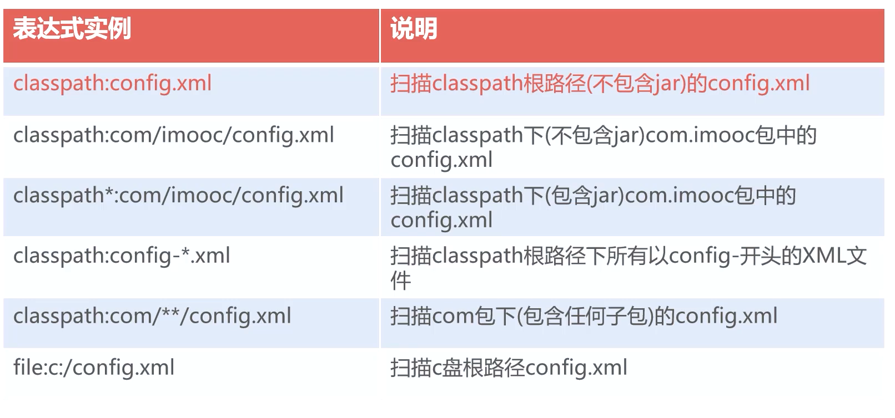
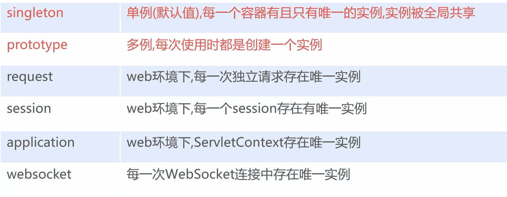
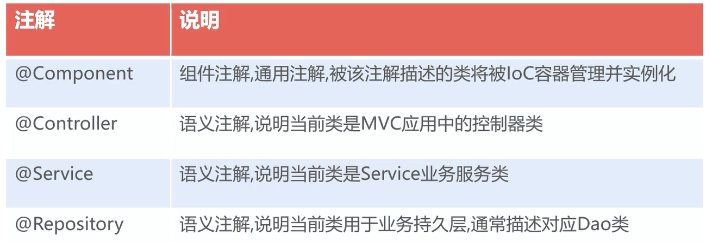
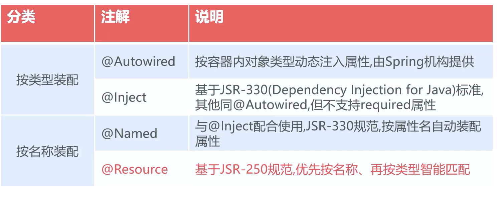
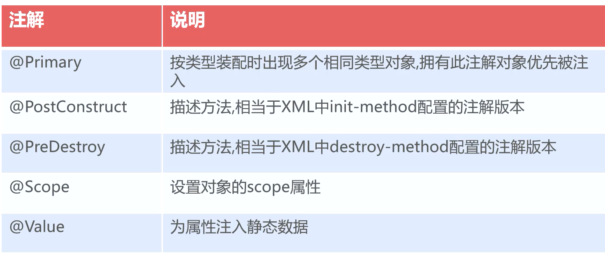
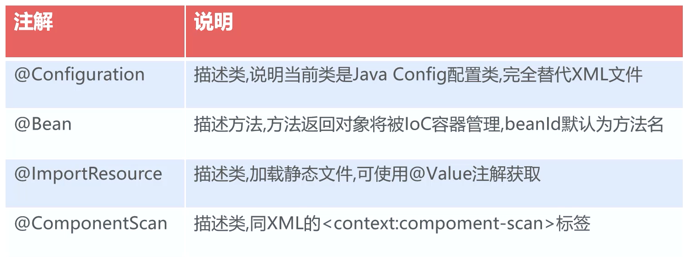
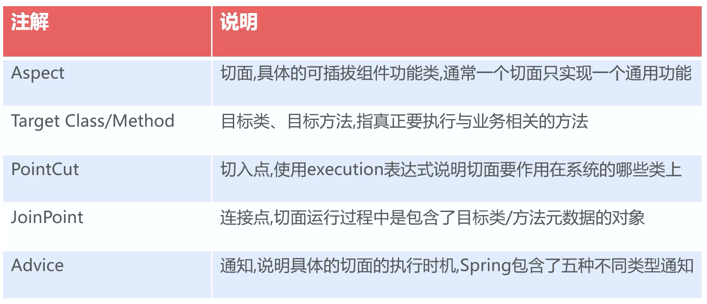
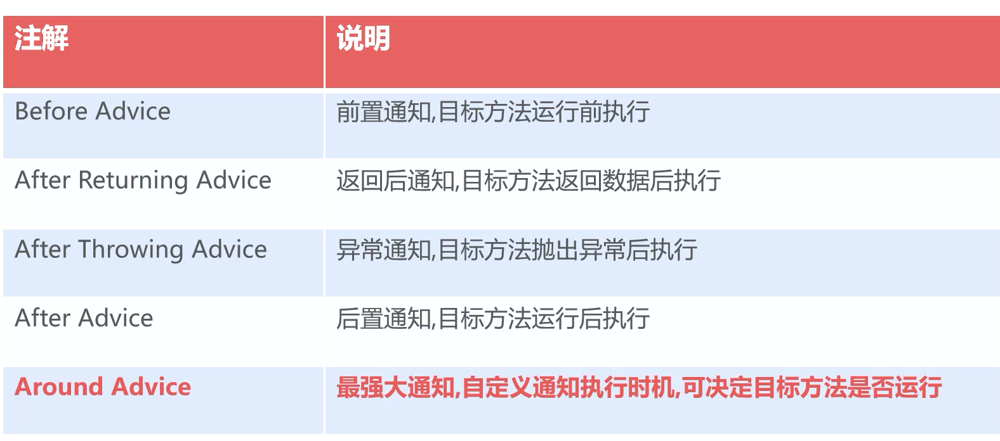
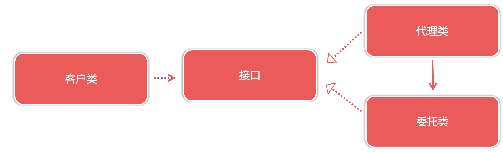
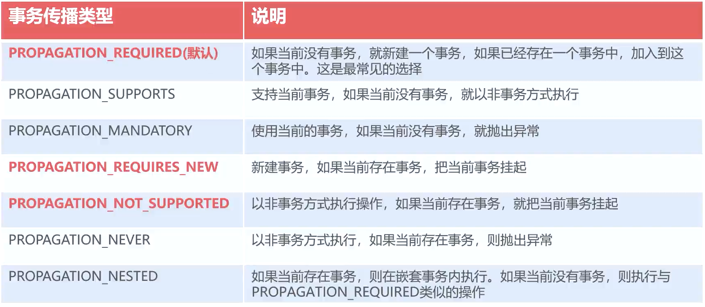

# `Spring`

核心框架  `IoC` 容器和 `AOP` 面向切面编程


### `Spring IoC`

`Inverse of Control` 是一种设计理念，由代理人创建和管理对象，消费者通过代理人来获取对象

`IoC` 的目的是为了降低对象之间的直接耦合

> 对象的创建权转嫁到中间角色，采用 `java` 中的反射技术实现运行是对象的创建


##### `DI` 依赖注入

利用 `java` 中的反射技术来实现	


##### 实例化 `Bean` 的三种方式

- 基于构造方法对象实例化

   ```xml
    <!-- 例用参数名实例化 -->
    <constructor-arg name="" value=""/>
    
    <!-- 例用参数位置实例化 -->
    <constructor-arg index="" value=""/>
   ```

    

- 基于静态工厂实例化

   ```xml
    <bean id="" class="Factory" factory-method="method"/>
   ```

    

- 基于工厂实例方法实例化

  ```xml
  <bean id="factoryInstance" class="FactoryInstance"/>
  <bean id="" factory-bean="factoryInstance" factory-method="method"/>
  ```
  


> `bean` 中 `id` 和 `name` 属性
>
> 都是设置对象在 `IoC` 容器的唯一标识，在同一配置文件中都不允许重复
>
> 允许在多个配置文件中重复出现，新对象覆盖旧对象
>
> `id` 要求更加严格，一次只能定义一个对象标识
>
> `name` 一次允许定义多个对象标识


### 路径表达式

`classpath` 代表编译之后 `class` 文件夹



### 依赖注入

- 基于 `setter` 方法注入对象
  - 默认属性赋值是调用 `setter` 方法进行赋值
  - `ref="beanId"` 属性关联赋值
- 基于构造方法注入对象


##### 注入 `List`

```xml
<bean id="" class="">
	<property name="someList">
    <list>
        <value></value>
        <ref bean=""></ref>
    </list>
    </property>
</bean>
```

> `set` 和 `map` 使用方法也类似
>
> `properties` 类似于 `map`，不过其中键值只能为 `string`，常用保存文本信息
>
> 引用设置可以直接设置属性


### 查看容器内对象

- `getBeanDefinitionNames()`
  - 获取 `beanId` 数组

> 未取名的对象命名规则 ：
>
> 完整类命`#number`，提取数据时如果只写完整类名，默认提取第一个元素


### `bean scope`

- 决定对象何时被创建及作用范围
- 影响容器内对象的数量
- 默认值为 `singleton`，全局共享一个对象实例


##### 属性值



> 单例模式为单例多线程执行，存在线程安全问题
>
> 单例模式下 `IoC` 容器启动时开始实例化，多例在调用 `getBean()` 或者对象注入时开启
>
> 属性在运行中不发生变化的一般设置为单例模式


##### 生命周期

- 容器行为
  - 对象行为
- `IoC` 初始化解析 `xml`
  - 对象实例化，执行构造方法
- 对象注入属性
  - 调用 `init-method` 初始化
- 初始化完毕
  - 执行业务代码
- 容器准备销毁
  - `destroy-method` 释放资源
- 销毁容器


### 注解

基于注解的 `XML` 和普通的 `XML` 不同，要开启新的命名空间

- 主键类型注解
  - 声明主键类的功能和职责
-  自动转配注解
  - 根据属性特征自动注入对象
- 元数据注解
  - 辅助 `IoC` 容器管理对象注解


##### 四种组件类型的注解



> 在不确定时通常使用组件注解，其他注解都是组件注解的细分


> 开启组件扫描功能
>
> ```xml
> <context:component-scan base-package="">
>  <!-- 正则表达式排除被扫描的文件 -->
> 	<context:exclude-filter type="regex" expression=""/>
> </context:component-scan>
> ```
>
> 组件类型注解默认 `beanId` 为类名首字母小写


##### 自动装配



> 按类型装配：不关心 `bean` 的名称，只考虑注入属性的类型
>
> 一般不推荐使用


在属性名或者 `setter` 方法上添加 `@Autowired` 都可以完成对象的注入，但是属性名注解没有执行 `setter` 方法

- `setter`
  - 自动按类型或者名称对方法参数进行注入
- 属性上
  - `IoC` 容器通过反射技术直接将属性 `private` 修饰符自动改为 `public`，直接进行赋值，不再执行 `setter`

> 一般使用时不会书写 `setter` 方法
>
> 按类型注入的缺点：面向接口编程扩展可能出现不是唯一 `bean` 的问题
>
> 1. 删去可能会导致冲突的注解
> 2. 引入 `@Primary` 注解


`@Resource`

- 设置 `name` 属性，按 `name` 注入属性
- 未设置 `name`
  - 以属性名作为 `bean`，`name` 在 `IoC` 容器中匹配 `bean`，有匹配就注入
  - 按属性名未注入，则按类型注入，和 `@Autowired` 一样需要加入 `@Primary` 解决冲突

> 一般保证设置 `name` 或者 属性名和 `bean` 名称保持一致


##### 元数据注解

为容器管理对象时提供一些辅助信息



> `@value(${})` 主要用于注入配置文件中的数据
>
> ```xml
> <!-- 加载配置文件 -->
> <context:property-placeholder location="classpath:*.properties"/>
> ```


##### `Java Config`

使用 `java` 代码来配置，使其摆脱了 `XML` 的束缚，可以对配置进行集中管理



> 使用这种方法编写可以在编译的时候发现错误，但是程序可维护性较低


##### `Spring Test` 整合 `JUnite 4`

- `Maven` 引入 `spring-test`
- 利用 `@RunWith` 和 `@ContextConfiguration` 描述测试用例
  - `@RunWith` 使得 `Spring` 接管 `Junite` 控制权
- 测试用例从容器获取对象完成测试用例执行


# `Spring AOP`

`Spring` 中可插拔的组件技术


##### 应用

为当前程序添加时间模块

- 引入模块

  - `spring-context`
  - `asceptjweaver`

- 创建切面类

  - 切面方法用于扩展额外功能

  > 切面方法必须添加 `JoinPoint`，通过连接点获取目标方法/类信息 

	```java
	public void printExecuteTime(JoinPoint joinPoint){

        SimpleDateFormat sdf = new SimpleDateFormat("yyyy-MM-dd HH:mm:ss");
        String now = sdf.format(new Date());
        String className = joinPoint.getTarget().getClass().getName();
        String methodName = joinPoint.getSignature().getName();

    }
	```

- 配置切面的作用范围

  ```xml
  <aop:config>
      <!-- PointCut 切点，使用 execution 表达式描述切面的范围 -->
      <aop:pointcut id="pointCut" expression="execution(public * aop..*.*(..))"/>
      <aop:aspect ref="methodAspect">
          <!-- 目标方法运行前，先执行切面方法 -->
          <aop:before method="printExecuteTime" pointcut-ref="pointCut"/>
     </aop:aspect>
  </aop:config>
  ```


##### `Spring AOP` 和 `AspectJ`

- `Eclipse AspectJ`，一种基于 `java` 平台的切面编程语言
- `AOP` 使用 `AspectJWeaver` 实现类和方法匹配
- `AOP` 利用代理模式实现对象运行时功能扩展


##### 关键概念




##### `PonitCut` 切点表达式

- `*`
  - 通配符
- `..`
  - 包通配符
- `(..)`
  - 参数通配符

> 一个正常的类方法的访问：
>
> `public void com.company.Class.method(parameter)`
>
> `public *	com ..*     .*(..)`


##### 五种通知类型

 

> 特殊的通知：
>
> 引介增强，是一种对类的增强，允许在运行时对目标类增加新的属性或方法


##### 应用

利用环绕通知实现性能筛查

> 环绕通知必须使用特殊的切入点 `ProceedingJoinPoint`，在原有的功能外，还可以控制目标方法是否执行 

```java
public Object check(ProceedingJoinPoint pjp) throws Throwable {

        try {
            long startTime = new Date().getTime();
            Object ret = pjp.proceed();
            long endTime = new Date().getTime();
            long duration = endTime - startTime;

            if (duration >= 1000) {
                System.out.println("=====" + duration + "(ms):" + pjp.getTarget().getClass().getName() + "." + pjp.getSignature().getName());
            }

            return ret;
        } catch (Throwable e) {
            throw e;
        }
    }
```


##### 基于注解配置 `Spring AOP`

```xml
<!-- 启用 aop 的注解模式 -->
<aop:aspectj-autoproxy/>
```

`@Aspect` 声明当前类为一个切片类

`@Around("execution()")` 声明其为一个环绕通知，并定义环绕通知的范围


# `AOP` 底层的实现原理

`Spring` 基于代理模式实现功能的动态扩展

- 目标类实现接口，通过 `JDK` 动态代理实现功能扩展
- 目标类没有实现接口，通过 `CGLib` 组件实现功能扩展


### 代理模式

通过代理对象对源对象实现功能扩展

> 类似于中介



- 代理类中持有委托类
- 代理类和委托类实现相同的接口

> 代理类 -- 中介	委托类 -- 房东	客户类 -- 房客	接口 -- 租房


##### 静态代理

需要手动创建代理类的代理模式


##### 动态代理

利用反射机制实现自动创建代理类

实现 `InvocationHandler` 接口 

- `proxy`
  - 代理类对象，通常是 `JDK` 代理类自动生成的
- `method`
  - 目标方法
- `args`
  - 目标方法传入的参数


### `CGLib`

`Code Generation Library`

将未继承接口的类 `$$EnhancerByCGLIB` 继承原始类

```java
// 前置处理代码
super.method()
// 后置处理代码
```


### `Spring JDBC`

对 `JDBC` 模块进行封装，极大简化开发的工作量

> 相比较 `MyBatis` 而言，`Spring JDBC`是对 `JDBC` 的简单封装，执行效率更加高


##### 使用步骤

- 引入依赖 `spring-jdbc`
- 在 `applicationContext.xml` 配置 `DataSource` 数据源
- 在 `Dao` 中注入 `JdbcTemplate` 对象

```xml
<!-- 设置数据源 -->
<bean id="dataSource" class="org.springframework.jdbc.datasource.DriverManagerDataSource">
	<property name="driverClassName" value="com.mysql.cj.jdbc.Driver"/>
    <property name="url" value="jdbc:mysql://localhost:3306/..."/>
    <property name="username"/>
    <property name="password"/>
</bean>

<bean id="jdbcTemplate" class="org.springframework.jdbc.core.JdbcTemplate">
	<property name="dataSource" ref="dataSource"/>
</bean>
```


##### 事务

编程式事务

通过代码手动提交回滚事务，`SpringJdbc` 通过 `TrasactionManager` 事务控制器来实现事务的控制（`commit` / `rollback`）

```xml
<bean id="transactionManager" class="org.springframework.jdbc.datasource.DataSourceTransactionManager">
	<property name="dataSource" ref="dataSource"/>
</bean>
```

```java
// 定义事务的默认标准配置
TransactionDefinition definition = new DefaultTransactionDefinition();
// 开启事务,返回事务状态
TransactionStatus status = transactionManager.getTransaction(definition);

try {
    transactionManager.commit(status);  
} catch() {
    transactionManager.rollback(status);
}
```


##### 声明式事务

在不修改源代码的情况下通过配置的形式自动实现事务的控制，其本质是 `AOP` 环绕通知

- 目标方法运行成功时，自动提交事务
- 目标方法抛出运行异常时，自动回滚事务


步骤

- 配置 `TransactionManager` 事务管理器
- 配置事务通知和事务属性
- 绑定 `PointCut` 切点

```xml
	<!-- 1.事务管理器，用于创建/提交/回滚   -->
    <bean id="transactionManager" class="org.springframework.jdbc.datasource.DataSourceTransactionManager">
        <property name="dataSource" ref="dataSource"/>
    </bean>
    <!-- 2.事务通知配置，决定哪些方法使用事务   -->
    <tx:advice id="txAdvice" transaction-manager="transactionManager">
        <tx:attributes>
            <!-- 3. 配置方法，使用事务传播行为 -->
            <tx:method name="batchMethod" propagation="REQUIRED"/>
            <!-- 4. 设置查询方法不支持事务机制 -->
            <tx:method name="find" propagation="NOT_SUPPORTED" read-only="true"/>
            <!-- 不支持条件的方法执行以下规则 -->
            <tx:method name="*"/>
        </tx:attributes>
    </tx:advice>
    <!-- 3.确认事务通知范围   -->
    <aop:config>
        <aop:pointcut id="pointcut" expression="execution(* jdbc..*Service.*(..))"/>
        <aop:advisor advice-ref="txAdvice" pointcut-ref="pointcut"/>
    </aop:config>
```


##### 事务传播行为 

多个拥有事务的方法在嵌套调用时事务的控制方式


使用方式

- `xml`
  - `<tx:method name="" propagation="">`
- 注解
  - `@Transactional(propagation=)`





##### 注解配置

- 添加扫描基本包

  - ```xml
    <context:component-scan base-package="">
    ```

- 设置数据源和、`jdbcTemplate` 和 `transactionManager`

- 启用注解形式声明事务

  - ```xml
    <tx:annotation-driven transacation-manager="transactionManager"/>
    ```

    
