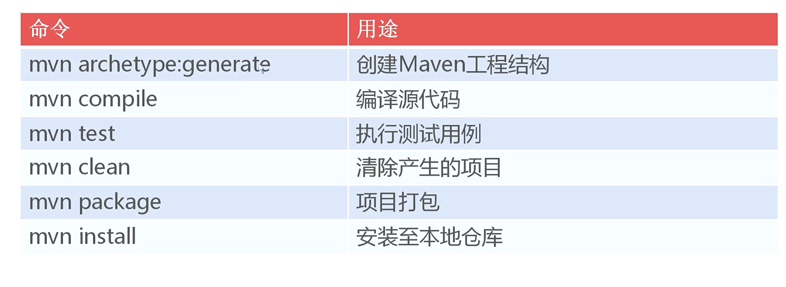
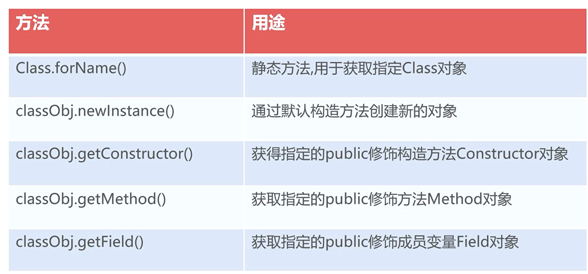
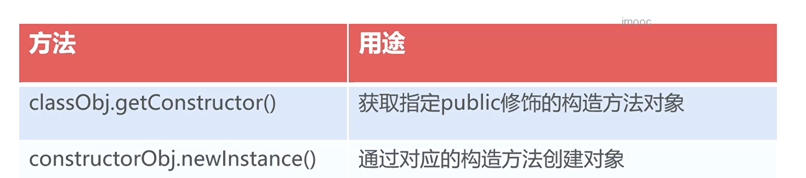
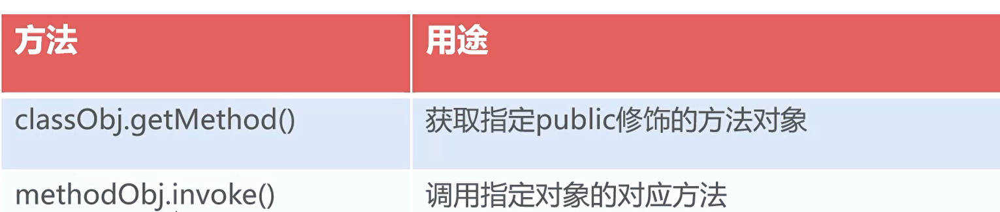
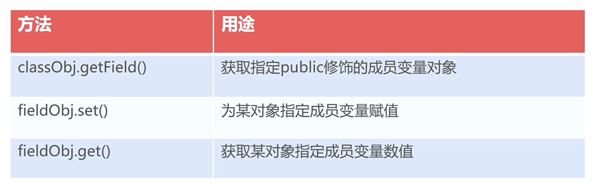
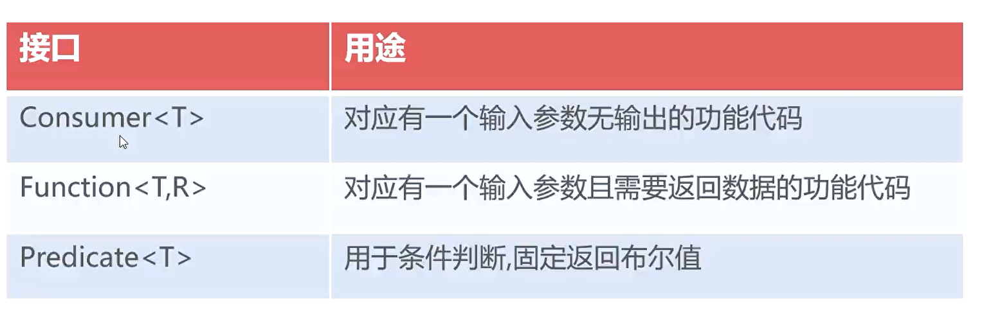
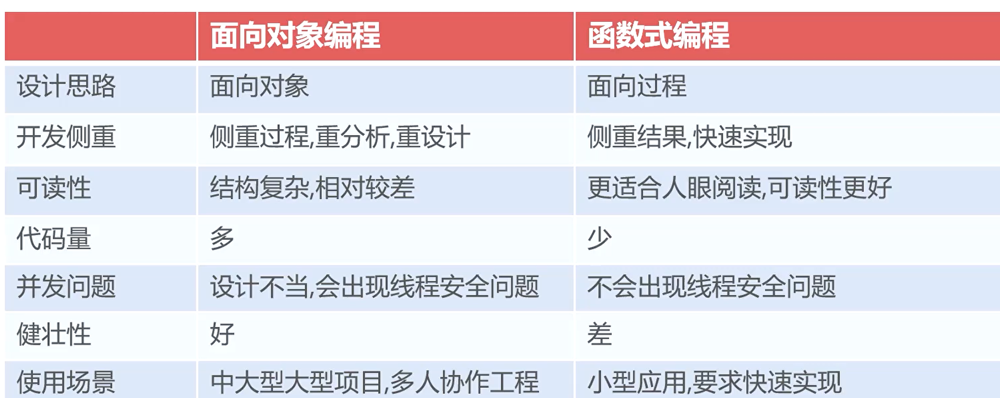
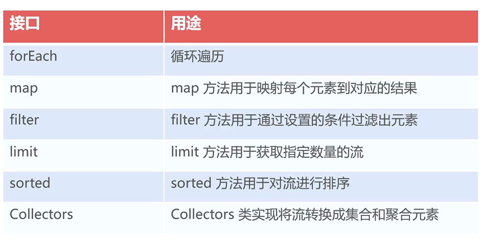

#  框架

###  `Maven`

项目管理工具，对软件项目提供构建和依赖管理；为 `java` 项目提供了统一的管理方式


##### `maven` 打包

`maven` 打包通常是通过插件来实现的

- `maven-assembly-plugin` 打包成 `jar`
- `maven-war-plugin` 打包成 `war `


##### 常用命令



### 工厂模式

隐藏创建对象的细节

- 原始的实现类要实现相同的接口
- 由工厂来决定具体的实现类


##### 项目应用

多端应用切换


### 反射

在运行时动态访问类和对象的技术

> 将创建对象的时机从程序编译时变到程序运行时
>
> 大部分框架技术都是基于反射的机制实现参数的配置、动态注入等特性


##### 核心类

- `Class`
- `Constructor`
- `Method`
- `Filed`


##### `Class`

`JVM` 中代表 `类和接口` 的类

包含了某个特定的类和结构信息

可以获取对应类的构造方法，方法和成员变量




##### `Constructor`

对 `java` 类中的构造方法的抽象

对象包含具体类的某个具体构造方法的声明

对象可以通过带参构造方法创建新对象




```java
Class className = Class.forName();
className.getConstructor(new Class[]{
    Integer.class, String.class
})
```


##### `Method`

某个类中方法的描述



```java
Method updateSalaryMethod = employeeClass.getMethod("updateSalary",new Object[]{
    Float.class
});
updateSalaryMethod(employee,new Object[]{
    1000f 
})
```


##### `Filed`

对应某个具体类中成员变量的声明

可对成员变量赋值、取值




##### `getDeclared` 系列方法

`get Constructor|Method|Filed` 只能获取 `public` 方法，访问非作用域时会抛出异常


```java
# 判断是否为 public 修饰
Filed[] fileds = employeeClass.getDeclaredFileds();

for (Filed filed:fileds){
    if (filed.getModifiers() == 1) // public 修饰
        filed.get(employee)
    else if (filed.getModifiers() == 2) // private
        filed.getMethod("get" + filed.getName.subString(0,1).toUpper() + filed.getName.subString(1)).invoke();
}
```


##### 反射案例

网站支持语言的切换（国际化）


### `Lambda`

更简洁的实现匿名内部类与函数的声明和调用

提供 `stream` 流处理极大简化对集合的操作

```
(参数列表) -> 实现语句
# 使用逗号分隔参数；参数类型可以省略；单个参数时，括号可以省略
# 实现语句：单行直接写，多行可以用{} 
```


`Lambda` 表达式只能实现有且只有一个抽象方法的接口，这样的接口被称为 函数式接口


##### 函数式编程

基于函数式接口并且使用 `lambda` 表达的编程方式

函数式编程思想将代码作为可重用的数据带入到程序中


`java1.8` 之后提供了一系列的函数式接口，位于 `java.util.function`

- `Consumer<T>`
  - 接收一个参数，不返回结果
- `IntConsumer`
  - 接收一个整数，不返回结果
- `Predicate<T>`
  - 判断，返回判断结果



> 如果需要多个参数情况，需要我们自己编写函数式接口
>
> `@FunctionInterface`





##### `stream` 流式处理

建立在 `lambda` 表达式上多数据处理的技术

对集合数据处理进行高度抽象，极大简化代码量

 