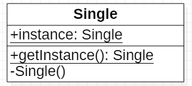
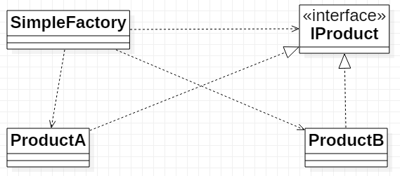
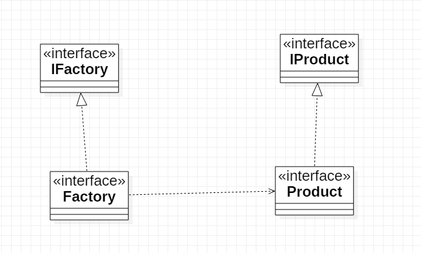
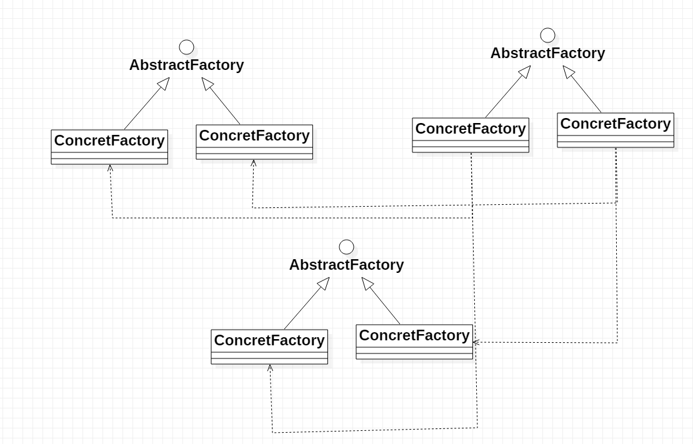

[返回](../DesignPattern.md)

# 设计模式

设计模式使得代码编程真正的工程化

符合 `OOD` 原则（高内聚，低耦合）


### 创建模式


##### 简单工厂模式

##### 工厂方法模式

##### 抽象工厂模式

##### 创建者模式

##### 原型模式

##### 单例模式


### 结构性模式


##### 外观模式

##### 适配器模式

##### 代理模式

##### 装饰模式

##### 桥接模式

##### 组合模式

##### 享元模式


### 行为型模式


##### 模板方法模式

##### 观察者模式

##### 状态模式

##### 策略模式

##### 职责链模式

##### 命令模式

##### 访问者模式

##### 中介模式

##### 备忘录模式

##### 迭代器模式

##### 解释器模式


### 单例模式

保证一个类仅有一个实例，并提供一个访问它的全局访问点

> 在 `Java` 中当单例模式：一个类有且仅有一个实例，并且自行实例化向整个系统提供


##### 关键点

某个类只有一个实例

必须自行创建这个实例

必须自行向整个系统提供这个实例


##### 使用

提供全局需要使用的，唯一的数据访问

#####  `UML` 

成员

- 静态的实例

##### 方法 

- 私有构造方法
- 静态的获取实例方法



##### 分类

- 饿汉式
  - 在类加载时创建
  - 线程安全
  - 可能造成资源浪费
- 懒汉式
  - 使用时判断，需要再创建
  - 为线程安全要付出额外的代价
  - `Synchronized方法`
  - 双重检测锁单例模式
  - 内部类 `Holder` (建议使用)

> 双重同步锁机制解决同步效率低问题

```java
public class SingleTonA {
    private static SingleTonA singleTonA;

    private SingleTonA() {

    }

    public static SingleTonA getInstance() {
        if (singleTonA == null) {
            synchronized (SingleTonA.class) {
                if (singleTonA == null) {
                    singleTonA = new SingleTonA();
                }
            }
        }
        return singleTonA;
    }
}
```


```java
public class SingleTonHolder {
    private static class SingleTonInnerHolder{
        private static SingleTonHolder singleTonHolder = new SingleTonHolder();
    }

    private SingleTonHolder(){

    }

    public static SingleTonHolder getInstance(){
        return SingleTonInnerHolder.singleTonHolder;
    }
}
```


### 工厂模式

##### 简单工厂模式

静态工厂方法模式，专门定义一个类来负责创建其他类的实例，被创建的实例通常都具有一个共同的父类




##### 工厂角色（`SimpleFactory`）

简单工厂模式的核心，负责创建所有类的内部逻辑

工厂类必须能直接被外部调用，创建需要的对象


##### 抽象产品角色（`IProduct`）

简单工厂模式创建的所有对象的父类（可以是接口或抽象类）


##### 具体产品


##### 优点

工厂类是整个模式的关键

判断逻辑——根据外界信息判断，判断创建哪个具体类的对象

使用时直接根据给定的工厂类创建实例（不需要了解对象的创建和组织）


##### 缺点

一个工厂出现问题，所有客户端都无法使用

由于简单工厂基于一个共同的抽象类或接口，当出现不同的接口或抽象类，违背单一职责

违背 `开放封闭原则`，当新增一个产品时必须修改工厂类，相应的类就需要重新编译


##### 实际应用

`JDBC`


### 工厂方法

一个抽象产品类派生出多个具体产品类；一个抽象工厂类派生多个具体的工厂类；每个具体的工厂类只能创建一个具体产品类的实例



##### 工厂接口

与调用者直接交互提供产品

> 有时使用一个抽象类来作为调用者交互的接口


##### 工厂实现

实例化产品，是实现扩展的途径


##### 产品接口

定义产品的规范，同样可以使用抽象类来代替

> 注意：不要违反里氏替换原则


##### 产品实现

实现产品接口的具体类，决定其在客户端中的行为


##### 优点

用户只需要知道具体工厂

系统添加新的产品时，只需要添加具体产品类和对应的实现工厂


##### 缺点

每次添加一个商品时需要添加一个具体类和对象实现工厂，增加了系统的复杂度和系统具体类的依赖


### 抽象工厂

多个抽象产品类，派生多个具体产品类；一个抽象工厂类，派生出多个具体工厂类；每个具体工厂类可以创建多个具体产品类



