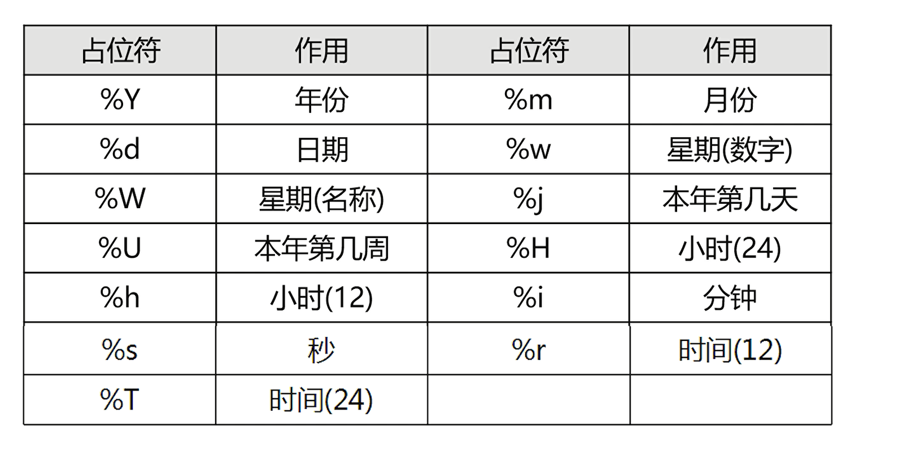
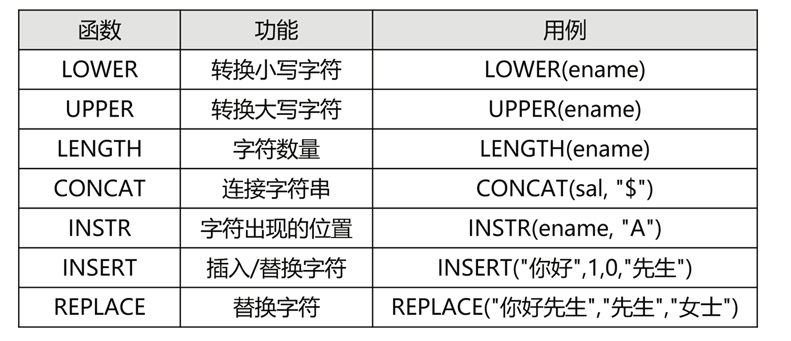
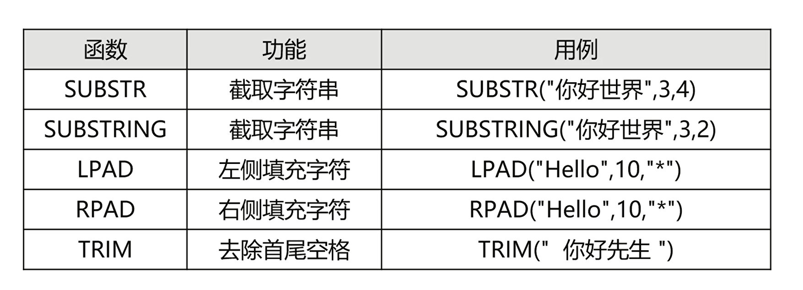
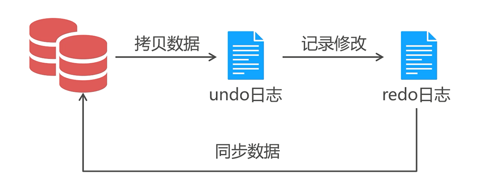
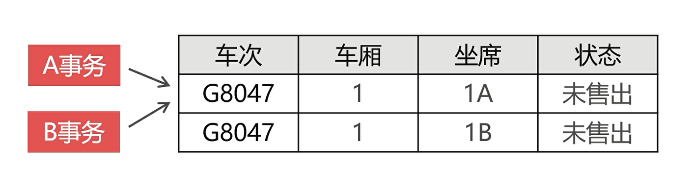

# 数据库


### 数据库系统

一个能为用户提供信息服务的系统


### 关系模型

数据是分类存放的，数据之间可以有联系


### 非关系型数据库

数据分开存放，但是数据之间没有关联关系

> 对于关系型数据库的补充，对于秒杀（多线程下出现超慢）
>
> 关系型数据库保存前需要建表，高速写入时进行的校验会导致速度降低


##### 重新设置 `root` 密码

1. 创建一个 `TXT` 文件，定义修改密码的 `SQL` 语句

   ```sql
   ALTER USER 'root'@'localhost' IDENTIFIED BY '123456'
   ```

   

2. 停止 `mysql` 服务

   ```mysql
   mysqld --default-file="{Mysql}\my.ini" --init-file=".txt" --console
   ```
3. 重新启动 `mysql` 服务


##### 配置文件

`my.init`

- 客户端配置信息
  - `client`
  - `mysql`
- 数据库配置信息
  - `mysqld`

```
[client]
port=3306

[mysql]
no-beep
# 发生错误时不要开启蜂鸣器

[mysqld]
port=3306
datadir=C:/ProgramData/MySQL/MySQL Server 5.7/Data
default-storage-engine=INNODB
sql-mode="STRICT_TRANS_TABLES,NO_AUTO_CREATE_USER,NO_ENGINE_SUBSTITUTION" # 开启严格模式
log-output=FILE
general-log=0 # 默认关闭日志
general_log_file="DESKTOP-PRLJBKM.log"
slow-query-log=1 # 开启慢查询日志
slow_query_log_file="DESKTOP-PRLJBKM-slow.log"
long_query_time=10 # sql 语句执行超过时间被判定为执行慢
log-error="DESKTOP-PRLJBKM.err"
server-id=1 # 数据库 ID （集群）
relay_log="DESKTOP-PRLJBKM-relay"
report_port=3306
lower_case_table_names=1 # 把表名转换为小写
secure-file-priv="C:/ProgramData/MySQL/MySQL Server 5.7/Uploads" # 导入导出数据地址
max_connections=151
table_open_cache=2000
tmp_table_size=41M
thread_cache_size=10
myisam_max_sort_file_size=100G
myisam_sort_buffer_size=74M
key_buffer_size=8M
read_buffer_size=64K
innodb_flush_log_at_trx_commit=1
innodb_log_buffer_size=1M
innodb_buffer_pool_size=8M
innodb_log_file_size=48M
innodb_thread_concurrency=17
innodb_autoextend_increment=64
innodb_buffer_pool_instances=8
innodb_concurrency_tickets=5000
innodb_old_blocks_time=1000
innodb_open_files=300
innodb_stats_on_metadata=0
innodb_file_per_table=1
innodb_checksum_algorithm=0
back_log=80
flush_time=0
join_buffer_size=256K
max_allowed_packet=4M
max_connect_errors=100
open_files_limit=4161
improved with query optimization
sort_buffer_size=256K
table_definition_cache=1400
binlog_row_event_max_size=8K
sync_master_info=10000
sync_relay_log=10000
sync_relay_log_info=10000
```


### 字段约束

##### 第一范式：原子性

第一范式是数据库的基本要求，不满足这一点就不是关系型数据库


##### 第二范式：唯一性

数据表中的每一条记录必须是唯一的。为了实现区分，通常使用唯一的列来进行标记，主键列


##### 第三范式：关联性

每一个列都必须存在直接关系，不存在传递依赖

> 按照第三范式来创建的表，将来在检索和提取数据时较为方便


| 约束键名称 | 关键字        | 描述                 |
| ---------- | ------------- | -------------------- |
| 主键约束   | `PRIMARY KEY` | 字段值唯一且不能为空 |
| 非空约束   | `NOT NULL`    | 字段值不能为空       |
| 唯一约束   | `UNIQUE`      | 字段值唯一可为空     |
| 外键约束   | `FOREGIN KEY` | 保持关联数据逻辑性   |

> 主键要求数字在全表必须唯一，且不能为空
>
> 主键建议使用数字，因为数字检索比较快 （`auto_increment`）


> 外键约束不推荐使用：
>
> 如果形成外键闭环之后，我们无法删除任何一张表


##### 索引

索引的本质是对数据进行排序


- 建表时添加索引
- 建表之后建立索引

```SQL
CREATE INDEX [idx_name] ON [table_name]([clo_name])
ALTER TABLE [table_name] ADD INDEX [idx_name]([clo_name])
DROP INDEX [idx_name] ON [table_name]
```


> 使用原则：
>
> 数据量很大，且经常被查询的数据表
>
> 索引只需要添加在经常被用作检索条件的字段上面
>
> 不要在大字段上创建索引


##### 查询

数据分页

```sql
SELECT * FROM TABLE 0,X;
```


结果集排序

```sql
SELECT ... FROM ... ORDER BY [clo] [ASC|DESC]
```


去除重复数据

```sql
SELECT DISTINCT ... FROM
```

> 如果查询多列数据，去重记录就会失效
>
> 在 SELECT 中只能使用一次


条件查询

```SQL
SELECT ... FROM ... WHERE ... [AND|OR] ...
```


### 高级查询


##### 聚合函数


`SUM`用于求和，只能用于数字类型，字符类型的统计结果为 `0`，日期类型为毫秒数相加 


`MAX` 求字段非空的最大值


`MIN` 求字段非空的最小值


`COUNT(*)`  用于获得包含空值的记录数，`COUNT(列名)` 用于获得包含非空值的记录数


##### 分组

默认情况下汇总函数是对全表范围进行数据统计

`GROUP　BY`　通过一定的规则将一个数据集划分为若干个小的区域，然后针对每一个小的区域分别进行数据汇总处理


> 查询语句如果包含 `group by` ，那么 `select` 必须遵守 
>
> `select` 子句可以包括聚合函数，或者 `group by` 子句的分组列，不能出现其余内容


对分组的结果集再次做汇总计算

```sql
SELECT 
FROM 
GROUP BY
WITH ROLLUP
```


`GROUP_CONCAT` 

把分组查询中的某个字段拼接为一个字符串


##### `HAVING`

不能单独使用，必需依赖 `group by` 使用

相当于 `where` 子句


##### 表连接

从多张表中提取数据，必须指定关联条件；如果不定义连接条件，会出现无条件连接，产生笛卡尔积


内连接

结果集只保留符合条件的记录

```sql
select ... from t1,t2 where 连接条件
select ... from t1 join t2 on 连接条件
select ... from t1 join t2 where 连接条件
```

> 内连接的表之间不一定需要有同名字段，只需要字段之间符合逻辑关系 
>
> 相同的数据表也可以做表连接


外连接

不管是否符合条件，记录都保存在结果集中

外连接分为左连接和右连接，可以保留不符合连接条件的记录

> 注意：
>
> 在内连接上 `where` 和 `on` 中效果相同，但是在外连接中 `where` 子句里面，不符合条件的记录会被过滤掉


##### 子查询

在查询语句中嵌套查询语句，

> `where` 子句中的子查询不推荐使用，一般使用表连接来代替
>
> 一般只推荐使用 `from` 查询


单行子查询

结果集只有一条数据


多行子查询

只能出现在 `where` 和 `from` 中

> `IN` `ALL` `ANY` `EXISTS` 子查询关键字


数据操作语言

`insert` 向数据表写入数据

> 一条语句无法向多表插入数据

```sql
insert into table() values()
```

> 不写表名后字段的声明会影响运行的速度


方言语法

```MYSQL
INSERT INTO table SET [clo=v]
```


##### `IGNORE`

```MYSQL
INSERT [IGNORE] INTO table
```

只插入数据库中不存在的记录


##### `UPDATE`

```mysql
UPDATE [IGNORE] table SET [clo=v]
[WHERE]
[ORDER BY]
[LIMIT]
```

表连接的 `UPDATE` 语句可以同时修改多张表

 

##### `DELETE`

```mysql
DELETE [IGNORE] 
FROM table 
WHERE
ORDER BY
LIMIT
```

> `IGNORE` 防止发生违反外键约束无法删除


##### 快速删除数据表全部的记录

`delete` 语句是在事务的机制下删除记录，删除记录前先把要删除的记录保存到日志文件中，然后删除

使用 `truncate` 语句绕过事务机制


### 函数

##### 数字函数

| 函数    | 功能     |
| ------- | -------- |
| `ABS`   | 绝对值   |
| `ROUND` | 四舍五入 |
| `FLOOR` | 取整   |
|`CEIL`|进位|
|`POWER (,)`|幂函数|
|`LOG(,)`|对数函数|
|`LN`|对数函数|
|`SQRT`|开平方|
|`PI`|圆周率|
|`SIN`||
|`COS`||
|`TAN`||
|`COT`||
|`RADIANS`|角度转换为弧度|
|`DEGREES`|弧度转化为角度|

##### 日期函数

`NOW()` 获取系统的日期和时间，格式 `yyyy-MM-dd hh：mm：ss`

> 数据库里面默认的时间最小单位为秒

`CURDATE()` 获取当前系统日期时间，格式 `yyyy-MM-dd`

`CURTIME()` 获取当前系统时间，格式 `hh：mm：ss`


##### 日期格式化函数

用来格式化日期，返回用户想要的日期格式

`DATE_FROMAT(日期，表达式)` 



> 日期函数不能进行加减乘除运算


##### 日期偏移计算

`DATE_ADD(日期，INTERVAL 偏移量 时间单位)` 可以实现日期偏移计算


##### 字符函数



 

##### 条件函数

- `IFNULL(表达式，值)`
- `IF(表达式，值1，值2)`

```mysql
CASE
	where 表达式 THEN 值
	where 表达式 then 值
	....
	ELSE 值
END 
```


### 事务

避免写入直接操作数据文件，采用日志文件来实现间接的写入

> `Mysql` 一共五种日志，其中只有 `redo` 和 `undo` 日志和事务有关



默认情况下，`Mysql` 执行每一条语句都会自动开启和提交事务，为了让多条语句纳入到一个事务下

```mysql
START TRANSACTION
	sql
commit|ROLLBACK
```


##### 事务的 `ACID` 属性

- 原子性
  - 事务的执行要不然全部成功，不然全部失败，不会停留在中间状态
- 一致性
- 隔离性
  - 事物之间互相不影响 
- 持久性


##### 隔离级别

- `read uncommited` 读取未提交的数据
- `read commit` 读取已提交数据
- `repeatable read` 重复读取 (默认)
- `serializable` 序列化

> 由于业务场景带来的问题，前三种隔离级别只适用于部分业务场景，但是序列化隔离性，让事务逐一执行，就不会产生上述问题

##### 业务一：允许该事务读取其他事务的状态



```mysql
SET SESSION TRANSACTION ISOLATION LEVEL
READ UNCOMMIT
```

 

##### 数据的导入和导出

数据导出，导出的为存粹的业务数据

数据备份，备份的为数据文件、日志文件、索引文件等


导出分类

- `SQL`

  - 导出业务数据，其中也包含表结构

  ```mysql
  mysqldump -uroot -p [no-data] 逻辑库 > 路径
  # no-data 不包含表结构
  
  source [name.sql]
  ```

  

- 文本文档

  - 体积小，导出速度快

  > 如果导入数据没有表，先建立表结构   
