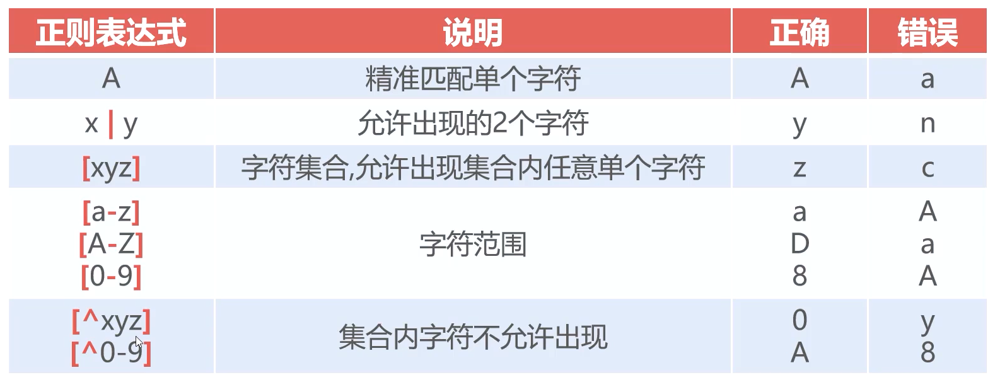
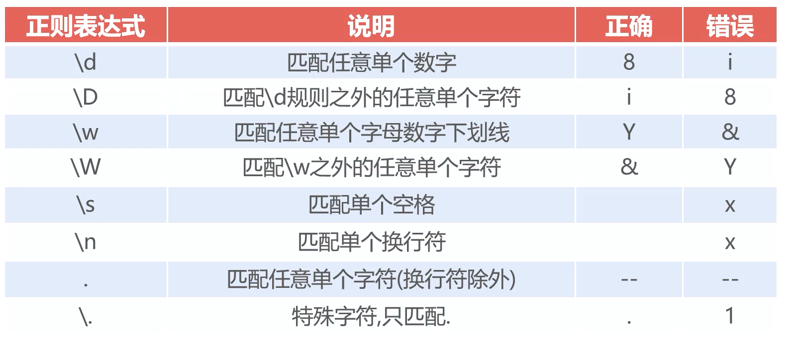
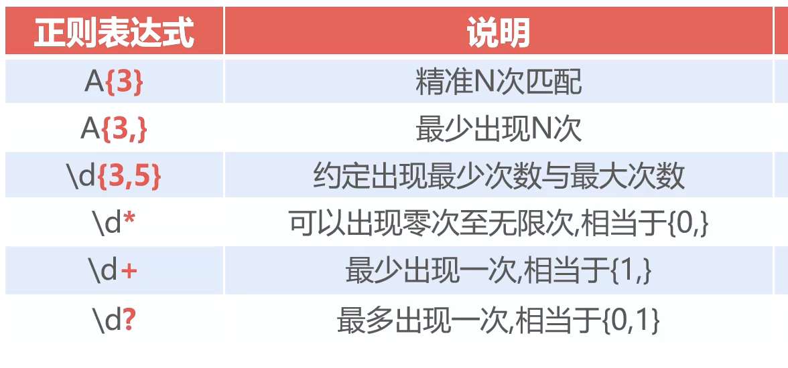
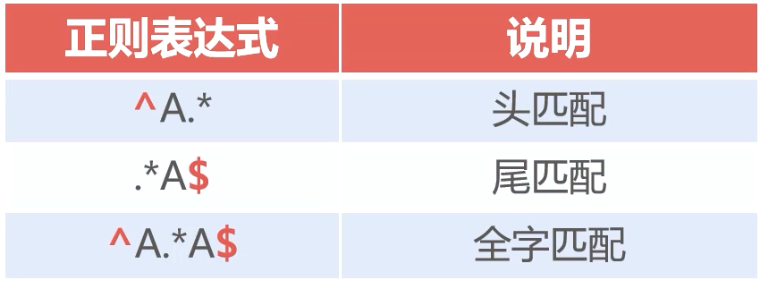
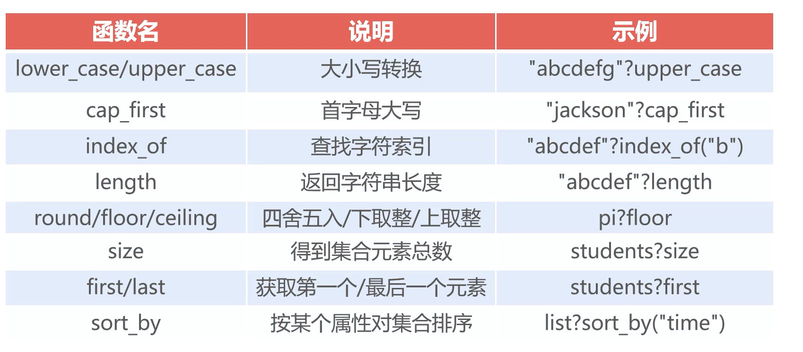
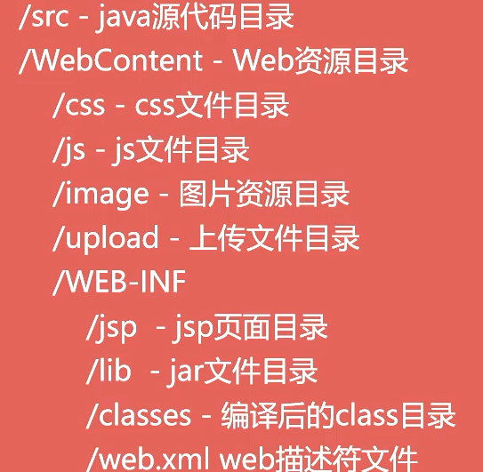

# `JavaWeb`


### 服务器加密连接

`Tomcat` 服务器启动时会启动多个 `Connector` ，而 `Tomcat` 服务器分为加密连接器和非加密连接器


##### 常见的加密方式

- 对称加密

  - 采用单密钥加密

- 非对称加密

  - 双方都持有对方的公钥

  > 通过 `CA` 机构确保公钥的可靠性


##### `https` 连接器

浏览器想要发送加密数据给服务器，服务器首先要出示一份 **数字证书** ，将生成的 `.keystore` 密钥库文件拷贝到 `Tomcat` 的 `conf` 文件下

```shell
# 生成 Tomcat 证书
keytool -genkey -alias tomcat -keyalg RSA
```


### `HTTP` 协议

它是 `TCP/IP` 协议的一个应用层协议，用于定义浏览器和服务器之间的数据交互过程

> `Http/1.0` 和 `Http/1.1` 区别
>
> `1.0` 客户端和 `web` 服务器建立连接，只能获取一个 `web` 资源
>
> `1.1` 在建立连接之后可以获取多个 `web` 资源


##### `Http` 请求

一个完整的 `HTTP` 请求包含：一个请求行，若干个消息头以及实体内容

- 请求行

  - 描述客户端的请求方式

  > 默认情况下为 `get`
  >
  > 使用 `Get` 方式 `URL` 地址后面的参数有限制，通常不能超过 `1k`

  - 请求的资源名称
  - 使用 `Http` 版本号

- 多个消息头

  - 客户端请求信息

- 一个空白行 


##### 消息头

- `accept`
  - 浏览器通过这个头告诉服务器，它所支持的数据类型　
- `Accept-Charset`
  -  浏览器通过这个头告诉服务器，它支持哪种字符集
- `Accept-Encoding`
  - 浏览器通过这个头告诉服务器，支持的压缩格式
- `Accept-Language`
  - 浏览器通过这个头告诉服务器，它的语言环境
- `Host`
  - 浏览器通过这个头告诉服务器，想访问哪台主机
- `If-Modified-Since`
  -  浏览器通过这个头告诉服务器，缓存数据的时间
- `Referer`
  - 浏览器通过这个头告诉服务器，客户机是哪个页面来的 防盗链
- `Connection`
  - 浏览器通过这个头告诉服务器，请求完后是断开链接还是何持链接


##### `Http` 响应

一个 `Http` 响应代表服务器向客户端发送回的数据，包括：一个状态行，若干消息头以及实体内容

- 状态行
  - 描述服务器对请求的处理结果
- 多个消息头
  - 描述服务器的基本信息
  - 数据的描述，可以通知客户端如何处理一会要返回的数据
- 实体内容
  - 服务器向客户端送回的数据


##### 状态行

- `HTTP` 版本号
- 状态码
- 原因叙述 `<CRLF>`

> 状态码：用于表示服务器对请求处理的结果，它是一个三位的十进制数
>
> `1XX`	表示成功接收请求，要求客户端继续提交下一次才能完成整个处理
>
> `2XX`	表示成功接收请求并已经完成整个处理过程，常使用 `200`
>
> `3xx`	为完成请求，客户端需要进一步细化请求
>
> `4xx`	客户端请求错误，常用 `404`
>
> `5xx`	服务器端出错，常用 `500`


##### 常用的响应头

- `Location`
  -  服务器通过这个头，来告诉浏览器跳到哪里
- `Server`
  - 服务器通过这个头，告诉浏览器服务器的型号
- `Content-Encoding`
  - 服务器通过这个头，告诉浏览器，数据的压缩格式
- `Content-Length`
  -  服务器通过这个头，告诉浏览器回送数据的长度
- `Content-Language`
  -  服务器通过这个头，告诉浏览器语言环境
- `Content-Type`
  - 服务器通过这个头，告诉浏览器回送数据的类型
- `Refresh`
  - 服务器通过这个头，告诉浏览器定时刷新
- `Content-Disposition`
  -  服务器通过这个头，告诉浏览器以下载方式打数据
- `Transfer-Encoding`
  - 服务器通过这个头，告诉浏览器数据是以分块方式回送的
- `Expires`
  -  -1 控制浏览器不要缓存
- `Cache-Control`
  - no-cache  
- `Pragma`
  -  no-cache


### `XML`

全称可扩展标记语言


##### 和 `HTML` 的比较

- `XML` 没有预定义标签，`HTML` 存在大量预定义标签
- `XML` 着重在于保存和传输数据，`HTML` 在于显示信息


##### 主要用途

- `java` 程序的配置文件描述
- 用于保存文件产生的数据
- 网络间数据的传输


##### `XML` 文档结构

- 第一行必须是 `XML` 声明
- 有且只有一个根节点
- `XML` 标签的书写规则和 `HTML` 相同


```xml
<?xml version="1.0" encoding="utf-8"?>
```


##### 书写规范

- 合法的标签名

  - 标签名要保证有意义
  - 使用英文小写，单词之间使用 `-` 分隔
  - 多级标签之间不存在重名

- 适当的注释和缩进

- 合理的使用属性

  - 通常把标签唯一的身份信息放置在属性中

- 特殊的字符和 `CDATA` 标签

  - `&lt;	<`
  - `&gt;	>`
  - `&amp;	&`
  - `&apos;	'`
  - `&apot;	"`

  > `CDATA` 标签指定不被 `XML` 解析器解析的文本数据
  >
  > `<![CDATA["开始，到"]]>`

- 有序的子元素


##### `XML` 语义约束

在结构正确的情况下，约束 `XML` 中哪些标签能出现，哪些不能

- `DTD`
- `XML Schema`


##### `DTD`

`Document Type Definition` 文档类型定义

- `<!ELEMENT>`

  - 定义允许出现的结点及其数量

  ```dtd
  <!-- a 结点下只允许出现一个 b -->
  <!ELEMENT a(b)>
  <!-- a 结点下必须包含以下的结点，且按顺序出现 -->
  <!ELEMENT a(b,c)>
  <!-- a 标签体只能是文本,#PCDATA 代表文本元素 -->
  <!ELEMENT a(#PCDATA)>
  ```

  > 定义节点数量，需要在子结点后面添加相对应的描述符
  >
  > `+` 最少出现一次	`*` 不限次	`？` 最多一个

引用 `DTD`

```dtd
<!DOCTYPE 根节点 SYSTEM "dtd文件">
```


###### 数据类型

`PCDATA` 

被解析的字符数据，文本中的标签被当作标签处理，实体会展开

`CDATA`

不会被解析器解析的文本


声明元素

```dtd
<!ELEMENT element-name category>
<!-- EMPTY 声明空元素	只有 PCDATA元素(#PCDATA)	ANY 任何可解析的元素 -->
```


属性

任何标记的属性都必须在 `DTD` 中声明，必须通过关键字来进行说明

```dtd
<!ATTLIST element-name attribute-name attribute-type attribute-value>
```

| 类型               | 描述                          |
| :----------------- | :---------------------------- |
| CDATA              | 值为字符数据 (character data) |
| (*en1*\|*en2*\|..) | 此值是枚举列表中的一个值      |
| ID                 | 值为唯一的 id                 |
| IDREF              | 值为另外一个元素的 id         |
| IDREFS             | 值为其他 id 的列表            |
| NMTOKEN            | 值为合法的 XML 名称           |
| NMTOKENS           | 值为合法的 XML 名称的列表     |
| ENTITY             | 值是一个实体                  |
| ENTITIES           | 值是一个实体列表              |
| NOTATION           | 此值是符号的名称              |
| xml:               | 值是一个预定义的 XML 值       |

默认属性

| 值           | 解释           |
| :----------- | :------------- |
| 值           | 属性的默认值   |
| #REQUIRED    | 属性值是必需的 |
| #IMPLIED     | 属性不是必需的 |
| #FIXED value | 属性值是固定的 |

实体

实体是定义引用普通文本或特殊字符的快捷方式的变量

```dtd
<!ENTITY entity-name "entity-value">
<!-- 实体的引用方式 &entity-name; 	-->
```


### `XML Schema`

`XML Schema` 比 `DTD` 复杂多，提供更多的功能

- 数据类型
- 格式限定
- 数据范围


##### 优点

保护数据通信

- 双方对于内容有相同的 期望值

可扩展性

- `Schema` 之间可以相互引用
- 可以创建基于标准数据类型衍生的数据类型
- 一个文档可以引用多个 `Schema`


每一个 `xml` 引用 `schema` 文件。需要书写在根标签上

- `xmlns=""`	
  - 引用的 `schema` 约束文件
- `targetNamespace`
  - 命名空间，`schema` 特有的属性
  - 定义 `schema` 被 `xml` 引用时的名称
- `xmlns:xsi`
  - 声明当前的 `xml` 文件是 `schema` 的一个实例，是被 `schema` 约束的
- `xsi:schemaLocation`
  - 引用 `schema` 的位置


##### `<schema>` 元素

> `<schema>` 元素是每一个 `XML Schema` 的根元素


##### `XSD` 元素

简易元素

仅包含文本元素，不包含其他其他元素或者属性

```xml
<element name="" type="">
```


##### 属性

简单元素无法拥有属性。一个元素拥有属性会被当作复合类型；属性本身可以作为简易类型声明

```xml
<xs:attribute name="" value="">
```


##### 限定

用于为 `XML` 元素或者属性定义可接受的值被称为 `facet`

```xml
<!-- 对元素范围限定 -->
<element name="">
	<simpleType>
    	<restriction base="integer">
        	<maxInclusive value=""/>
            <minInclusive value=""/>
        </restriction>
    </simpleType>
</element>

<!-- 使用枚举类型 -->
<element name="">
	<simpleType>
    	<restriction base="integer">
        	<enumeration value=""/>
        </restriction>
    </simpleType>
</element>
```


| 限定             | 描述                                                 |
| :--------------- | :--------------------------------------------------- |
| `enumeration`    | 定义枚举                                             |
| `fractionDigits` | 定义最大正小数                                       |
| `length`         | 定义允许的长度                                       |
| `maxExclusive`   | 定义数值的上限 （不包含）                            |
| `maxInclusive`   | 定义数值的上限 （包含）                              |
| `maxLength`      | 定义最大长度                                         |
| `minExclusive`   | 定义数值的下限（不包含）                             |
| `minInclusive`   | 定义数值的下限（包含）                               |
| `minLength`      | 定义允许的最小长度                                   |
| `pattern`        | 定义可接受的字符的精确序列                           |
| `totalDigits`    | 定义所允许的阿拉伯数字的精确位数，必须大于0          |
| `whiteSpace`     | 定义空白字符（换行、回车、空格以及制表符）的处理方式 |


##### 复合元素类型

- 空元素
- 包含其他元素
- 仅包含文本
- 包含元素和文本


### `DOM` 文档对象模型

`Document Object Model` 定义访问和操作 `XML` 文档的标准方法


### `Dom4j`

简单易用的解析 `XML` 的开源库

- 将 `XML` 视为 `Document` 对象
- `XML` 标签被定义为 `Element` 对象 


### `Xpath`

`Xpath` 是一门在 `XML` 文档中查找信息的语言（对元素和属性遍历）


##### 结点

- 元素
- 属性
- 命名空间
- 处理指令
- 注释
- 文档（根）结点


##### 基本值

无父结点和子结点


##### 项目

基本值或者节点


##### 基本表达式

| 表达式     | 描述                                                       |
| :--------- | :--------------------------------------------------------- |
| `nodename` | 选取此节点的所有子节点。                                   |
| /          | 从根节点选取。                                             |
| //         | 从匹配选择的当前节点选择文档中的节点，而不考虑它们的位置。 |
| .          | 选取当前节点。                                             |
| ..         | 选取当前节点的父节点。                                     |
| @          | 选取属性。                                                 |


##### 谓语表达式

基本表达式再添加约束条件

| 路径表达式                         | 结果                                                         |
| :--------------------------------- | :----------------------------------------------------------- |
| /bookstore/book[1]                 | 选取属于 bookstore 子元素的第一个 book 元素。                |
| /bookstore/book[last()]            | 选取属于 bookstore 子元素的最后一个 book 元素。              |
| /bookstore/book[last()-1]          | 选取属于 bookstore 子元素的倒数第二个 book 元素。            |
| /bookstore/book[position()<3]      | 选取最前面的两个属于 bookstore 元素的子元素的 book 元素。    |
| //title[@lang]                     | 选取所有拥有名为 lang 的属性的 title 元素。                  |
| //title[@lang='eng']               | 选取所有 title 元素，且这些元素拥有值为 eng 的 lang 属性。   |
| /bookstore/book[price>35.00]       | 选取 bookstore 元素的所有 book 元素，且其中的 price 元素的值须大于 35.00。 |
| /bookstore/book[price>35.00]/title | 选取 bookstore 元素中的 book 元素的所有 title 元素，且其中的 price 元素的值须大于 35.00。 |


### `Jaxen`

开源的 `Xpath` 库 


### `JASON`

数据由键值描述，由逗号分隔

大括号代表一个完整的对象，拥有多个键值对

中括号用于保存数组，多个对象之间使用逗号分隔 


### `FastJASON`

阿里巴巴的著名 `json` 序列化和反序列化工具包


### `jQuery` `Ajax`


##### `jQuery`  选择器

选择元素并进行处理


```html
jQuery(选择器表达式)
$(选择器表达式)
```


##### `Ajax`

可以在不刷新的情况下，实现页面的局部更新


##### 使用

- 创建 `XmlHttpRequest`
  - 因为 `XmlHttpReque` 不是 `w3c` 标准，不同的浏览器创建方法不一样
- 发送 `Ajax` 请求
- 处理服务器响应


```javascript
// 创建 XMLHttpRequest 对象
var xmlhttp;
if (window.XMLHttpRequest) {
    xmlhttp = new XMLHttpRequest();
} else {
    xmlhttp = new ActiveXObject("Microsoft.XMLHTTP")
}

// 创建请求
xmlhttp.opean()

// 发送请求
xmlhttp.send()

// 监听 AJAX 执行过程
xmlhttp.onreadystatechange()

// 说明 xmlHttpRequest 状态
xmlhttp.readyState

// 服务器响应状态码
```

 

##### 异步和同步

一旦使用同步的功能会导致 `onreadystatechange` 设置的方法失效

同步执行代码进入等待状态，数据不返回，程序不会向下执行


### `Jquery` 对 `ajax` 的支持

`jQuery` 对 `AJAx` 进行了封装，提供了 `$ajax()` 方法

| 名称                         | 值/描述                                                      |
| :--------------------------- | :----------------------------------------------------------- |
| `data`                       | 规定要发送到服务器的数据。                                   |
| `dataType`                   | 预期的服务器响应的数据类型。(`text|json|xml|html|jsonp|script`) |
| `error(xhr,status,error)`    | 如果请求失败要运行的函数。                                   |
| `success(result,status,xhr)` | 当请求成功时运行的函数。                                     |
| `type`                       | 规定请求的类型（GET 或 POST）。                              |
| `url`                        | 规定发送请求的 URL。默认是当前页面。                         |

> `jsonp` 主要用于解决跨域访问问题


### 二级联动菜单实现

```html
<script type="text/javascript">
    $(function () {
        $.ajax({
            "url": "/ChannelServlet",
            "data": {"level": "1"},
            "type": "get",
            "dataType": "json",
            "success": function (json) {
                console.log(json);
                for (let i = 0; i < json.length; i++) {
                    $("#lv1").append("<option value=" + json[i].code + ">" + json[i].name + "</option>");
                }
            }
        })
    })

    $(function () {
        $("#lv1").on("change", function () {
            var parent = $(this).val();
            $.ajax({
                "url": "/ChannelServlet",
                "data": {"level": "2", "parent": parent},
                "type": "get",
                "dataType": "json",
                "success": function (json) {
                    console.log(json);
                    $("#lv2>option").remove();
                    for (let i = 0; i < json.length; i++) {
                        var data = json[i];
                        $("#lv2").append("<option value = " + data.code + ">" + data.name + "</option>")
                    }
                }
            })
        })
    })
</script>
<body>
<select id="lv1" style="width: 200px;height: 30px">
    <option selected="selected">请选择</option>
</select>
<select id="lv2" style="width: 200px;height: 30px"></select>
```


### 正则表达式


##### 字符范围匹配




##### 元字符匹配

元字符，特定的表达某一类的字符




##### 多次重复匹配



##### 定位匹配




##### 贪婪模式和非贪婪模式

非贪婪模式

在满足条件的情况下尽可能少的匹配到字符串

在描述数量的后面使用 `?`


> 在 `JS` 中定义正则表达式对象只需要 `//` 中书写正则表达式


### `Servlet`

一门开发动态 `web` 资源的技术


##### 开发步骤

- 编写 `java` 类，实现 `servlet` 接口
- 部署到服务器


##### 运行过程

- 服务器检查是否创建并加载 `Servlet` 实例对象，如果是直接执行第四步
- 创建并装载 `Servlet` 实例对象
- 调用 `Servlet` 实例对象的 `init()` 方法
- 创建 `HttpServletRequest` 对象和 `HttpServletResponse` 对象，然后调用 `Servlet` 中的 `service()` 方法，将请求和响应对象作为参数传入
- `WEB` 服务器停止或者重新启动之前，`Servlet` 引擎将会卸载 `Servlet`，并且在卸载之前调用 `Servlet` 中的 `destory()` 方法


##### 接口实现类

两个默认的接口实现类：`GenericServlet` `HttpServlet`

`HttpServlet` 只能够处理 `HTTP` 请求的 `Servlet`

> 在原有接口上添加了一些与 `Http` 协议处理方法


##### `Servlet` 类和普通 `java` 类

`Servlet` 是一个供 `Servlet` 引擎调用的类，它不能独立运行

通常情况下服务器只会创建一个 `Servlet` 实例对象，及一旦创建它会驻留在内存，直至 `WEB` 容器退出

在整个生命周期中 `init()` 只会被调用一次。而对 `Servlet` 每一次访问请求对会导致 `Servlet` 调用一次 `service()` 方法，同时创建新的 `HttpServletRequest` 和 `HttpServletResponse` 对象


##### 缺省 `Servlet`

如果某个 `Servlet` 映射为 `/` ，那么这个 `Servlet` 就成为 `WEB` 应用程序的缺省 `Servlet`

凡是在 `web.xml` 文件中找不到匹配的 `URL`，访问请求都会交给 缺省 `Servlet`


##### 线程安全

当多个 `Servlet` 同时访问一个 `Servlet`，`web` 服务器会为每一个客户端访问请求创建一个线程，调用 `service()` 方法，如果 `service` 访问同一个资源，会发生线程安全的问题

> 可以使用线程锁来解决问题，但是通常不使用这种方法
>
> 针对线程安全问题使用 `SingleThreadModel` 接口，这个接口不能真正的解决多线程安全问题，它只是创建了多个对象实现多个单线程


### `ServletConfig`

##### 配置 `Servlet` 初始化参数

```xml
<!-- 使用该标签配置 servlet 初始化参数 -->
<init-param>
	<param-name></param-name>
    <param-value></param-value>
</init-param>
```


##### 通过 `ServletConfig` 获取 `Servlet` 初始化参数

当 `servlet` 配置了初始化参数之后，`web` 容器在创建实例对象时，会自动将这些初始化参数封装到 `ServletConfig` 对象中，在调用 `init` 方法时，将它传递给 `servlet`


### `ServletContent` 对象

`WEB` 容器在启动时，它会为每一个 `WEB` 应用程序创建一个对应的 `ServletContent` 对象，它代表当前 `web` 应用

`ServletConfig` 对象维护 `ServletContent` 对象的引用，我们使用 `ServletConfig.getServletContent` 来获取 `ServletContent` 对象

一个 `WEB` 应用所有的 `servlet` 共享同一个 `servletContent` 对象，因此 `servlet` 对象可以通过 `ServletContent` 对象实现通讯


##### 多个 `servlet` 实现数据共享

- 通过 `ServletConfig` 获取 `ServletContent` 对象的引用
- 将数据存储到对象中


##### `WEB` 应用初始化参数

```xml
<!-- 配置WEB应用初始化参数 -->
<content-param>
	<param-name></param-name>
    <param-value></param-value>
</content-param>
```

```java
ServletContext context = this.getServletContext();
//获取整个web站点的初始化参数
String contextInitParam = context.getInitParameter("url");
response.getWriter().print(contextInitParam);
```


##### 实现请求转发

```java
ServletContext context = this.getServletContext();//获取ServletContext对象
RequestDispatcher rd = context.getRequestDispatcher("URL");//获取请求转发对象(RequestDispatcher)
rd.forward(request, response);//调用forward方法实现请求转发
```


##### 读取资源文件

```java
// 防止乱码
response.setContentType("text/html;charset=UTF-8");
```


##### 在客户端缓存 `Servlet` 的输出

对于不常变化的数据，可以为 `Servlet` 设置合理的缓存时间，避免浏览器频繁的向服务器发送请求

```java
response.setDateHeader("expires",System.currentTimeMillis() + 24 * 3600 * 1000);
```


### `HttpServletResponse` 对象

代表服务器的响应。这个对象封装了向客户端发送数据，响应头，状态码


##### 使用 `OutputStream` 流向客户端输出中文

服务器端数据是以那个码输出的，控制客户端浏览器以相应的码打开


```java
String data = "";
OutputStream outputstream = response.getOutputStream();
response.getHeader("content-type", "text/html;charset=UTF-8");
byte[] dataByteArr = data.getBytes("UTF-8"); //以指定编码进行转换
outputStream.write(dataByteArr);
```


##### 使用 `PrintWriter` 流向客户端输出中文

```java
response.setCharasetEncoding("UTF-8");
PrintWriter out = response.getWriter();
```

> 一般输出字符数据使用 `PrintWriter` 比较方便，省去将字符转换成字符数组


##### 文件下载

- 获取待下载文件的绝对路径‘
- 获取下载文件名
- 设置 `content-disposition` 相应头控制浏览器以下载形式打开文件
- 获取待下载文件的输入流
- 创建数据缓冲区
- 通过 `response` 对象获取 `OutputStream` 流
- 将 `FileInputStream` 流写入到 `buffer` 缓冲区
- 使用 `OutputStream` 将缓冲区数据输出到客户端浏览器


```java
//1.获取要下载的文件的绝对路径
String realPath = this.getServletContext().getRealPath("/download/1.JPG");
//2.获取要下载的文件名
String fileName = realPath.substring(realPath.lastIndexOf("\\")+1);
//3.设置content-disposition响应头控制浏览器以下载的形式打开文件
response.setHeader("content-disposition", "attachment;filename="+fileName);
//4.获取要下载的文件输入流
InputStream in = new FileInputStream(realPath);
int len = 0;
//5.创建数据缓冲区
byte[] buffer = new byte[1024];
//6.通过response对象获取OutputStream流
OutputStream out = response.getOutputStream();
//7.将FileInputStream流写入到buffer缓冲区
while ((len = in.read(buffer)) > 0) 
	//8.使用OutputStream将缓冲区的数据输出到客户端浏览器
	out.write(buffer,0,len);
```

> 中文文件下载需要注意：
>
> 中文文件名要使用 `URLEncoder.encode` 方法进行编码，否则出现中文名乱码
>
> 文件下载推荐使用 `OutputStream`
>
> `OutputStream` 使用的是字节流，可以处理任意类型的文件，`PrintWriter` 是字符流，只能处理字符，处理其他文件时候可能导致数据丢失


### `HttpServletResponse` 常见应用

##### 

##### 生成验证码

生成图片使用 `BufferedImage` 类


```java
// 在内存中创建一张图片
BufferedImage image = new BufferedImage(,,);

// 获取图片
Graphics2D g = (Graphics2D)image.getGraphics();
g.setColor(Color.WHITE);//设置图片的背景色
g.fillRect(0, 0, 80, 20);//填充背景色

// 向图片上写入数据
g.setColor(Color.BLUE);//设置图片上字体的颜色
g.setFont(new Font(null, Font.BOLD, 20));
g.drawString(makeNum(), 0, 20); // 生成随机数

//4.设置响应头控制浏览器浏览器以图片的方式打开
response.setContentType("image/jpeg");//等同于response.setHeader("Content-Type", "image/jpeg");

//5.设置响应头控制浏览器不缓存图片数据
response.setDateHeader("expries", -1);
response.setHeader("Cache-Control", "no-cache");
response.setHeader("Pragma", "no-cache");

//6.将图片写给浏览器
ImageIO.write(image, "jpg", response.getOutputStream());
```


##### `URL` 地址推荐写法

书写 `URL` 建议使用 `/` 开头，也就使用绝对路径的方式

> `/` 在服务器中代表当前的 `web` 工程
>
> `/` 在浏览器中代表 `webapps` 目录


- `/` 代表 `web` 工程的情况

  - `ServletContent.getRealPath(String path)`
  - `forward`
  - 使用 `<jsp:include page="/">`

- `/` 代表 `webapps` 目录常见的情景

  - `sendRedirect()`

  > 推荐使用 `request.getContextPath()` 代替 `/项目名称`

- 使用超链接进行跳转

- `Form` 表单提交

- `js` 脚本和 `css` 文件的引用


### `HttpServletRequest`

代表客户端的请求，当客户端通过 `Http` 协议访问服务器，请求信息都封装在这个对象中


##### `request` 方法

- `getRequestURL`
  - 返回客户端发出请求时的完整URL
- `getRequestURI`
  - 方法返回请求行中的资源名部分
- `getQueryString `
  - 方法返回请求行中的参数部分
- `getPathInfo`
  - 方法返回请求URL中的额外路径信息。额外路径信息是请求URL中的位于Servlet的路径之后和查询参数之前的内容，它以“/”开头
- `getRemoteAddr`
  - 方法返回发出请求的客户机的IP地址
- `getRemoteHost`
  - 方法返回发出请求的客户机的完整主机名
- `getRemotePort`
  - 方法返回客户机所使用的网络端口号
- `getLocalAddr`
  - 方法返回WEB服务器的IP地址
- `getLocalName`
  - 方法返回WEB服务器的主机名


##### `request` 接收表单提交参数中文乱码

`post` 方式提交参数乱码

> 通过设置统一编码方式解决 `request.setCharacterEncoding("")`

`get` 方式乱码

> 以 `get` 方式传输的数据即使设置了指定的编码接收数据任会产生乱码
>
> 解决：接收数据，先获取 `request` 对象以 `ISO8859-1` 接收的原始字符数组，通过指定的编码构建字符串


```java
String name = request.getParameter("name");//接收数据
name =new String(name.getBytes("ISO8859-1"), "UTF-8") ;//获取request对象以ISO8859-1字符编码接收到的原始数据的字节数组，然后通过字节数组以指定的编码构建字符串，解决乱码问题
```

超链接形式乱码

处理方式和 `get` 方式相同，可以使用 `URLEncoder.encode` 对参数先进行处理


### 过滤器

`Servlet` 下的组件，主要用来对 `URL` 进行统一的拦截处理

过滤器通常用于应用程序进行全局处理


##### 开发过滤器的步骤

- 实现 `javax.servlet.Filter` 接口
- 在 `Filter` 接口实现 `doFilter()` 方法中编写过滤器功能代码
- 在 `web.xml` 中配置过滤器，说明拦截 `URL` 的范围 


```xml
<!-- filter 标签用来说明哪个类是过滤器，并在启动时自动加载 -->
<filter>
    <filter-name></filter-name>
    <filter-class></filter-class>
</filter>
<!-- 映射 fiter 范围 -->
<filter-mapping>
    <filter-name></filter-name>
    <url-pattern></url-pattern>
</filter-mapping>
```


##### 生命周期

- 初始化 `init()`
- 提供服务 `doFilter()`
- 销毁服务 `destroy()`


##### 注解形式开发过滤器

`@WebFilter(filterName="", urlPatterns="")`


##### 字符过滤器

主要用来解决乱码问题

`GET` 请求通过 `server.xml` 添加 `URLEncoding="UTF-8"`

`POST` 请求使用 `request.setCharacterEncoding("UTF-8")`

响应部分 `response.setContentType("text/html;charset=UTF-8")`


```java
HttpServletRequest req = (HttpServletRequest)request;
req.setCharacterEncoding("UTF-8");
HttpServletResponse res = (HttpServletResponse)response;
res.setContentType("text/html;charset=UTF-8");
chain.doFilter(request,response);
```


##### 过滤链

每一个过滤器都应该具有独立的职能

过滤器执行的顺序由 `<filter-mapping>` 来决定

调用 `chain.doFilter()` 将请求向后传递

> 可以通过控制 `chain.doFilter()` 调用实现防火墙的功能


##### 应用

多端设备自动匹配


### 监听器


##### 三种监听器

- `ServletContext`
  - 对全局属性进行监听
- `HttpSession`
  - 用户会话及用户属性
- `ServletRequest`
  - 请求及属性操作


##### 开发监听器三要素

- 实现 `Listener` 接口，不同监听器监听不同的对象
- 实现每个接口的独有方法
- 配置 `<listener>` 


##### 应用

请求流量分析

- 使用监听器实现 `ServletContextListener` `ServletRequestListener`
- 根据 `request` 请求添加次数
- 创建 `servlet`  处理流量
- 使用 `fastJson` `jQuery` `echars` 实现图表可视化


静态数据预处理

- 实现 `ServletContextListener`
- 初始化添加静态数据预加载


### `Freemarker`

- `Freemarker` 是免费开源的模板引擎
- `Freemarker` 脚本为 `Freemarker Template Language`
- `Freemarker` 提供大量内置函数简化开发


##### `jsp` 和 `freemarker`

- `jsp` 为官方的执行标准，`Freemarker` 不是
- `jsp` 执行方式为编译型，`Freemarker` 为解释型
- `jsp` 执行效率较高，开发效率低，扩展能力差
- `jsp` 数据提取方式 `JSTL + EL`，`Freemarker` 内置标签


##### 使用

- 加载模板
- 创建数据
- 产生输出


##### `FTL` 取值

- `${属性名}`
- `${属性名!默认值}`
- `${属性名?string("yyyMMdd")}`
  - 格式化输出


##### 分支判断

```ftl
<#if 条件>
	执行代码
<#elseif 条件>
	执行代码
<#else>
</#if>

<#switch value>
	<#case refValue>
		...
	<#break>
</#switch>
```


##### `list` 迭代列表

```
<#list student as stu>
	<li>${stu_index}</li>
</#list>

<# 迭代 Map>
<#list map?kes as key>
	${key}:${map[key]}
</#list>
```


##### 内建函数



##### `Freemarker` 和 `Servlet` 整合

- `Servlet` 中配置 `Freemarker`  信息


### `MVC` 模式

- 视图
  - 展示最终结果
  - 一般为 `jsp` 或者模板引擎
- 控制器
  - 常用 `Servlet`
    - 接收数据
    - 调用处理类
    - 跳转到视图
- 模型
  - 负责产生业务数据，通常使用 `Service` 结尾


##### 工程结构




##### 包的结构


> `Servlet` 只允许单向调用 `Dao`


##### `JavaBean`

不是一种技术，是一种 `java` 类的格式要求，通常用于存储数据


- 类必须 `public` 并且提供默认的构造方法
- 所有属性私有化
- 属性的操作提供 `getter` 和 `setter`
