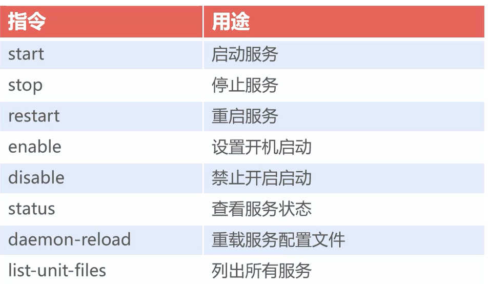

# `Linux` 下的常用命令


### 系统管理命令

- `ifconfig`
  - 查看网络 `ip`
- `netstat -tulpn / -ano`
  - 查看网络端口号
- `ps -ef`
  - 查看进程

- `kill -9 PID`
  - 杀掉进程


##### `netstat` 常用选项

| 选项 | 用途                       |
| ---- | -------------------------- |
| `t`  | `tcp` 传输状态             |
| `u`  | `udp` 传输状态             |
| `l`  | 显示处于监听状态的网络连接 |
|`p`|显示应用`PID`和程序名称|
|`n`|显示`ip`地址|
|`a`|显示所有连接|
|`o`|显示计时器|


##### 应用服务化 `systemctl`

应用进程以服务方式在系统后台运行




- 确定 `PID` 文件的存在

  - 保存当前进程的编号，用来关闭或者重启服务

- 创建服务描述文件 `.service`

- `systemctl daemon-reload`

  - 重载 `service`

- `systemctl start redis`

   


```shell
# redis.service
[Unit]
Description=Redis
After=syslog.target network.target remote-fs.target nss-lookup.target

[Service]
Type=forking
PIDFile=/run/redis.pid
ExecStart=/user/local/../redis-server /user/...redis.conf
ExecStop=/bin/kill -s QUIT $MAINPID
PrivateTmp=true

[Install]
# 将服务分配到服务组中
WantedBy=multi-user.target
```


### 防火墙设置

`Centos7` 基于 `firewall` 实现应用层的防火墙，`Centos6` 使用基于 `iptables`


##### 对外开放 `Tomcat`

- 查看防火墙放行的端口

  - `firewall-cmd --list-ports`

- 设置 `8080` 端口放行

  - `firewall-cmd --zone=public --permanent --add-port=8080/tcp`

  > `--add-port=8000-9000/tcp` 放行区域内端口

- 重载

  - `firewall-cmd --reload`
