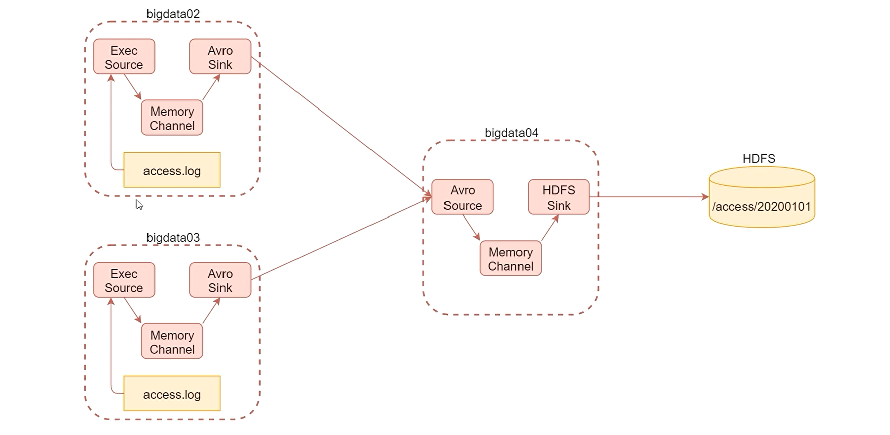

# 大数据


### `Hadoop`

适合数据分布式存储和分布式计算


> 成功格式化之后如果还想要再次格式化，删除 `/data/hadoop_repo` 当中的信息


### `HDFS`

是一种允许文件通过网络在多台主机上分享文件系统（分享文件和存储空间）

> 不适合小文件存储


```shell
bin/hdfs dfs -xxx scheme://authority/path
#scheme	hdfs
#authority	ip:port
#path	path
#以上信息及 core-site.xml 中文件的信息
```


##### `HDFS体系结构`

主节点 `NameNode`，支持多个 ；从节点 `DataNode`，支持多个；`SecondaryNameNode`，一个


##### `NameNode`

整个文件的管理节点

主要维护整个文件系统的文件目录树，文件/目录信息，每个文件对应的数据块列表，并且还负责接收用户操作请求


##### `SecondaryNameNode`

定期的将 `edit` 文件的内容合并到 `fsimage` 中

> 这个合并操作称之为 `checkpoint` 
>
> 在 `namenode` 的 `HA` 框架中没有 `SecondaryNameNode` 进程，文件合并操作由 `stabdby NameNode` 负责
>
> `SecondaryNameNode` 在 `Hadoop 1.x` 中是必须的，但是在 `Hadoop 2.x` 之后不是


##### `DateNode`

提供真实数据文件的存储

`HDFS` 按照固定的大小，顺序的将文件进行划分并且编号，每一个划分称之为 `block`，默认的 `Block` 大小为 `128MB` 

> `HDFS` 中，如果一个文件小于一个数据块大小，不会占用整个数据


副本

多副本机制，默认设置为 3 


总结：

`NameNode` 维护两份关系

- `File` 和 `Block list` 之间的关系

> `NameNode` 启动时，会将文件中的元数据信息加载到内存
>
> 每个原数据信息占用 150 字节

- `DateNode` 和 `Block`  

> `DateNode` 启动时，会把当前结点上的 `Block` 信息和结点信息上报给 `NameNode`


##### `HDFS` 回收站

在回收站中的数据会有一个生命周期，文件在一段时间之内，没有被用户恢复，文件会被自动删除


##### 安全模式

集群在刚刚启动时 `HDFS` 会进入安全模式，此时无法执行写操作

```
# 查看安全模式
hdfs dfsadmin -safe1 get
# 离开安全模式
hdfs dfsadmin -safemode leave
```


##### 高扩展性和高可用性

多个 `NameNode` 解决宕机导致的单点故障问题

多个 `NameNode` 结点通过 `Federation` 机制


`HA` 表示一个集群中存在多个 `NameNode`，只用一个 `NameNode` 是 `active` ，其他的为 `standby`

`ANN` 负责所有客户端的操作

`SNN` 用来同步 `ANN` 的状态，提供快速故障恢复能力

> 使用 `HA` 时不能启动 `SecondaryNameNode`


`Federation`

可以解决单一名命空间问题

- 扩展性
  - 使得每一个 `NameNode` 分管一部分目录
- 高效性
- 隔离性


##### `MapReduce`

主要是由两部分组成 `Map` 和 `Reduce`

`Map`

- 框架把输入文件（夹）划分为很多 `InputSplit` ，默认情况下每一个 `Block` 对应一个 `InputSplit`；通过 `RecordReader` 把每一个 `InputSplit` 解析成一个个 `<K,V>`
- 框架调用 `map()` 
- 框架对 `map` 函数输出的 `<K,V>` 进行分区，不同的分区由不同的 `Reduce Task` 处理，默认只有一个分区
- 每个分区数据按键值排序并分组
- ***选择执行*** `Combiner`
  - 在 `map` 端提前执行局部聚合
- 写入本地文件

> `Map` 阶段的工作是必须的，但是 `Reduce` 阶段的工作是可以省略的（数据不需要最终的聚合）


`Reduce`

- 框架对多个 `Map Task` 的输出，按照不同分区，通过网络克隆到不同的 `Reduce` 结点，整个过程叫做 `shuffle`
- 接收相同分区的 `<K,V>` 数据，进行合并，排序，分组
- 调用 `reduce()` 方法，每一个 `<K,{v...}>` 调用一次 `reduce`函数
- 数据结果保存到 `HDFS`

```java
job.setNumReduceTasks(0);
# 禁用 reduce
```


##### `MapReduce` 日志

开启 `yarn` 上的日志聚合功能，把散落在 `NodeManager` 上的日志信息统一管理

```xml
# yarn-site.xml
<name>yarn.log-aggregation-enable</name>
<value>ture</value>

<name>yarn.log.server.url</name>
<value>http://[]:19888/jobhistory/logs/</value>
```

```shell
bin/mapred --ademon start historyserver
```


> 使用命令查看日志 —— 面试
>
> `yarn logs --applicationId <ID>`


##### `Hadoop` 中的序列化

> `Text` 等价于 `java.lang.string` 的 `Writeable`，针对 `UTF-8`
>
> `NULLWriteable` 是单例，获取实例使用 `NULLWriteable.get()`


### 性能优化

##### 小文件问题

小文件处理效率低，而且十分消耗内存资源

> `Map Reduce` 启动本身要消耗性能，导致运行的时间没有启动时间长

解决办法：

选择一个容器，将小文件整合

- `SequenceFile`

  - `Hadoop` 提供的一种二进制文件，直接将 `<key,value>` 序列化到文件

  > 合并文件需要一个过程，文件较大，且合并之后文件不方便查看，必须通过遍历查看每一个小文件

- `MapFile`

  - `MapFile` 为排序之后的 `SequenceFile` ，主要由两部分组成 `index` 和 `data`

  > `index` 作为文件的数据索引，主要记录每个 `Record` 值，以及其在文件中的偏移位置
  >
  > 在文件被访问时，索引文件加载到内存，通过映射关系可以迅速定位到指定位置


##### 数据倾斜问题

`Reduce` 结点大部分执行完成，但是有一个或者几个运行较慢，导致整个程序处理的时间的边得很长


`MapReduce` 主要是由 `Map` 和 `Reduce` 两部分，一般认为 `Map` 的任务个数和数据块有关（除海量小文件，其余不需要人工干预）；默认情况下 `Reduce` 个数为一个，可以考虑增加 `Reduce` 个数来实现数据分流

> 如果单个 `Reduce` 执行速度慢，单靠增加结点个数无法提高运行效率
>
> 将结点上的数据进行有规律的打散 


通过改变 `key` ，来改变生成的 `HashCode` 最后影响分区 


### `Yarn`

`yarn` 不仅支持 `MapReduce`，还支持 `spark` 、`Flink` 等计算

`yarn` 主要负责集群的资源管理和调度，支持主从架构，主节点可以有两个，从节点不限

`ResourceManager` 主节点负责集群资源分配和管理

`NodeManager` 从节点负责当前机器的资源管理


`yarn` 主要负责管理内存和CPU

`NodeManager` 启动时向 `ResourceManager` 注册，注册信息包含该结点可分配的CPU和内存总量

```xml
<!--- 单节点分配的物理内存总量，默认8MB*1024  --->
yarn.nodemanager.resource.memory-mb

<!--- 单节点分配虚拟CPU个数，默认为8 --->
yarn.nodemanager.resource.cpu-vcores
```


##### 资源调度器

- `FIFO Scheduler`
  - 先进先出
- `Capacity Scheduler` （一般默认）
  - `FIFO` 多队列版
- `Fair Scheduler`
  - 多队列模式，共享资源

##### 案例

`yarn` 多资源对列配置和使用

1. 增加 `online` 和 `offline` 对列
2. 向 `offline` 对列提交任务

> 修改 `capacity-scheduler.xml`

```shell
-Dmapreducequeuename=offline
```


### `Flume`

一个高可用，高可靠，分布式海量日志采集、聚合和传输系统

- `source`
  - 数据源，读取产生的日志数据
- `channel`
  - 数据临时存储
- `sink`
  - 负责将数据从临时存储的数据读出，写到对应磁盘


1. 简单的、灵活的基于流的数据结构
2. 具有负载均衡和故障转移机制
3. 简单可扩展


##### `source`

从外界采集各种类型的数据，将他们传递给 `channel`

- `Exec Source` 实现文件监控

- `NetCat TCP/UDP Source` 采集指定端口的数据
- `Spooling Directory Source` 采集文件夹新增的文件
- `Kafka Source` 从 `Kafka` 消息对列中采集数据


##### `Channel`

接受 `Source` 发送出来的数据，临时存储文件

- `Memory Channel` 使用内存作为数据存储
  - 效率高
  - 可能会丢失数据，内存不一定够
- `File Channel` 文件作为数据存储
  - 数据不会丢失
- `Spillable Memory Channel` 使用内存和文件作为数据存储，先存储到内存中，等到内存中数据到达一个阈值再 `flush` 到文件


##### `Sink`

从 `Channel` 读取数据并存储到指定目的地

表现形式：控制台、`HDFS`、`Kafka` ...


> `channel` 数据直到写到目的地才会被删除，如果 `sink` 写入失败会自动重写


- `Logger Sink` 数据作为日志处理（测试）
- `HDFS Sink` 写入到 `HDFS` （离线）
- `Kafka Sink` 写入到 `kafka` 消息队列 （实时）


##### 配置

1. 为组件起名
2. 配置每一个组件
3. 连接组件

```
a1.sources=r1
a1.sinks=k1
a1.channels=c1

a1.sources.r1.type=netcat
a1.sources.r1.bind=localhost
a1.sources.r1.port=44444 # 连接产生局限性，可以使用 0.0.0.0 来代替

a1.sinks.k1.type=logger

a1.channels.c1.type=memory
a1.channels.c1.capacity=1000
a1.channels.c1.transactionCapacity=100

a1.sources.r1.channels=c1
a1.sinks.k1.channel=c1
```


```shell
# 启动命令
bin/flume-ng agent --name a1 --conf conf --conf-file conf/example.conf -Dflume.root.logger=INFO,console
```


连接

```
telnet localhost 44444
```


##### 案例：

采集文件内容上传 `HDFS`

```
a1.sources=r1
a1.sinks=k1
a1.channels=c1

a1.sources.r1.type=spooldir
a1.sources.r1.spoolDir=/data/log/studentDir

a1.channels.c1.type = file
a1.channels.c1.checkpointDir = /data/soft/apache-flume-1.9.0-bin/data/studentDir/checkpoint
a1.channels.c1.dataDirs = /data/soft/apache-flume-1.9.0-bin/data/studentDir/data

a1.sinks.k1.type = hdfs
a1.sinks.k1.hdfs.path = hdfs://master:9000/flume/studentDir
a1.sinks.k1.hdfs.filePrefix = stu-
a1.sinks.k1.hdfs.fileType = DataStream
a1.sinks.k1.hdfs.writeFormat = Text
a1.sinks.k1.hdfs.rollInterval=3600
a1.sinks.k1.hdfs.rollSize=134217728
a1.sinks.k1.hdfs.rollCount=0

a1.sources.r1.channels=c1
a1.sinks.k1.channel=c1
```


采集网站站上的数据上传到 `HDFS`

1. 将两台机器实时产生的日记数据汇总到一台机器
2. 机器将数据统一上传到 `HDFS` 指定目录
3. `HDFS` 目录按天生成，每天一个目录



> 启动顺序：先启动 `4` 结点


```
a1.sources=r1
a1.sinks=k1
a1.channels=c1

a1.sources.r1.type=exec
a1.sources.r1.command=tail -F /data/log/access.log

a1.channels.c1.type=memory
a1.channels.c1.capacity=1000
a1.channels.c1.transactionCapacity=100

a1.sinks.k1.type=avro
a1.sinks.k1.hostname=[IP(04)]
a1.sinks.k1.port=45454 

a1.sources.r1.channels=c1
a1.sinks.k1.channel=c1
```


```
a1.sources=r1
a1.sinks=k1
a1.channels=c1

a1.sources.r1.type=avro	
a1.sources.r1.bind=0.0.0.0
a1.sources.r1.port=45454 # 连接产生局限性，可以使用 0.0.0.0 来代替

a1.sinks.k1.type = hdfs
a1.sinks.k1.hdfs.path = hdfs://master:9000/access/%Y%m%d
a1.sinks.k1.hdfs.filePrefix = access
a1.sinks.k1.hdfs.fileType = DataStream
a1.sinks.k1.hdfs.writeFormat = Text
a1.sinks.k1.hdfs.rollInterval=3600
a1.sinks.k1.hdfs.rollSize=134217728
a1.sinks.k1.hdfs.rollCount=0
a1.sinks.k1.hdfs.useLocalTimeStamp=true

a1.channels.c1.type=memory
a1.channels.c1.capacity=1000
a1.channels.c1.transactionCapacity=100

a1.sources.r1.channels=c1
a1.sinks.k1.channel=c1
```

> `avro sink` 和 `avro resource` 必须保持端口一致 


##### 高级组件

- `Source Interceptors` 指定一个或者多个拦截器按照先后顺序依次对采集的数据进行处理
  - `Search and Replace Interceptor`
    - 可以根据规则修改 `body` 中的数据
  - `Regex Extractor Interceptor`
    - 根据正则规则抽取 `<k,v>` 添加到 `header`
- `Channel Selectors` `Source` 发往多个 `Channel` 的策略
- `Sink Processors` `Sink` 发送数据的策略


`Event`

`Flume` 传输数据的基本单位，也是事务的基本单位，通常一行数据记录就是一个 `Event`

`Event` 包含 `header` 和 `body` 

> `header` 的类型为 `Map<String, String>`，我们可以在 `Source` 中增加 `header` 的值，以便在 `channel` 和 `sink` 中使用
