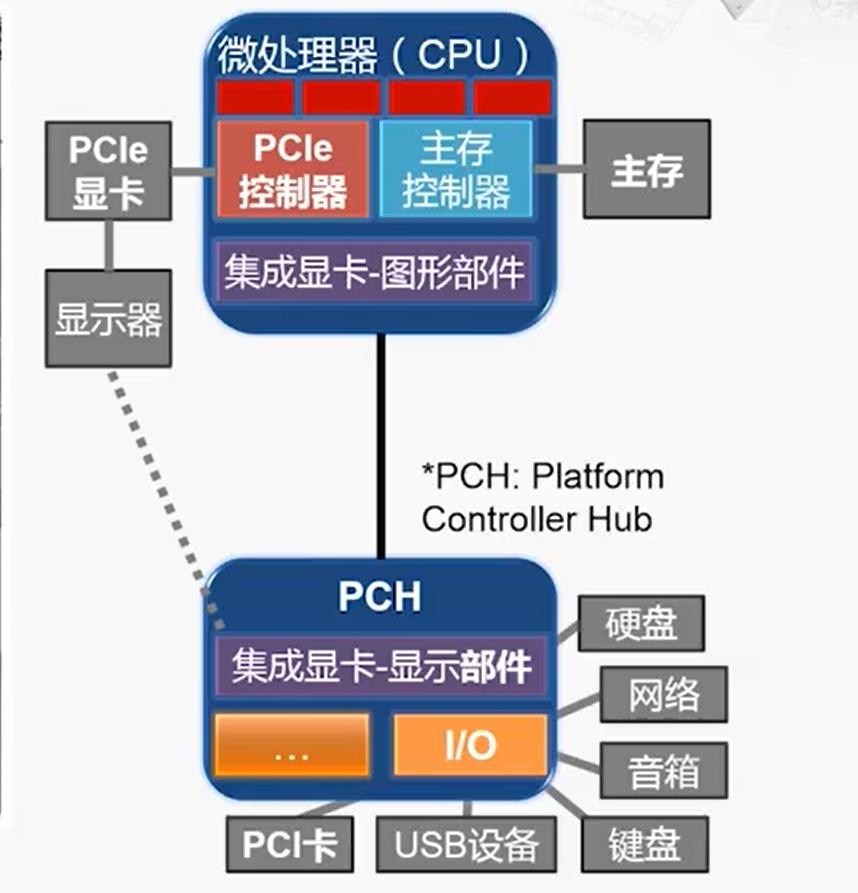

# 计算机组成原理

### 冯诺依曼结构

两个重要的设计思想

- 存储器（不是开关连线）
- 二进制

计算机的五部分

- 运算器 (`CA`)
- 控制器 (`CC`)
- 存储器 (`M`)
- 输入设备 (`I`)
- 输出设备 (`O`)

**数据和程序** 均以 **二进制代码** 形式不加区别的存放在存储器中，存放位置由存储器指定

##### 核心

运算器，控制器和存储器是冯诺依曼结构的核心

##### 主存

- 地址
  - 每个存储单元对应的编号
- 内容
  - 存储单元存放的信息

> **主存** 货架存放物品，**CPU** 厨师 **运算器** 厨房

##### 模型机的构建

> 存储单元的地址是唯一的，存储单元的位宽由设计计算机时的编址方式决定。如果按字节编址，每个存储单元存放 `8` 位二进制数

##### `MAR`

`Memory Address Register` 存放 `CPU` 正在读或写的存储单元地址

##### `MDR`

`Memory Data Register` 存放 `CPU` 正在读出或即将写入存储单元的数据

- `IR`
  - 指令寄存器，存放正在执行或即将执行的指令
- `PC`
  - 程序计数器，存放下一条指令的存储单元地址，具有自动增长计数
- 指令译码
  - 对 `IR` 中的指令进行译码
- 控制电路
  - 根据指令译码的结果，控制电路产生控制信号，控制组件动作

### 计算机执行指令主要步骤

- 取址
- 译码
- 执行
- 回写

### 运算器

核心部件为 `ALU` 用于完成算数核心运算和逻辑运算

- `ALU` 将 `X` `Y` 中取到数经过运算存储到 `Z` 中
- `F` 用于存放运算结果的状态 (零/正负/溢出/进位/)
- 通用寄存器用来存放临时数据
  - 数据可以来自存储器或 `ALU` 的输出

##### 冯诺依曼结构原理和实现

- `CPU`
  - `CA`
  - `CC`
- 主存
  - `M`
- 北桥
- 南桥
  - `I/O`
  - 硬盘
    - `R`
  - `BIOS`
    - `R`

> 为了解决影响性能最大的问题 `CPU` 访问主存的通道，北桥中的主存控制器移到 `CPU` 中，之后便是显示部件
>
> 最终大部分的北桥中的原本功能移植到了 `CPU` 中，将南北桥的功能集成到了南桥芯片中

##### 系统芯片

将计算机或者其他电子系统集成为单一芯片的集成电路

### 指令系统

- 设计指令
  - 运算指令
    - `ADD R,M`
  - 传送类指令
    - `LOAD R,M`
  - 转移类指令
    - `JUMP L`
- 指令格式
  - 每条指令等长，均为 `2` 字节
  - 第一个字节的高 `4` 位为操作码
  - 第一个字节的低 `4` 位为寄存器号
  - 第二个字节为存储单元地址